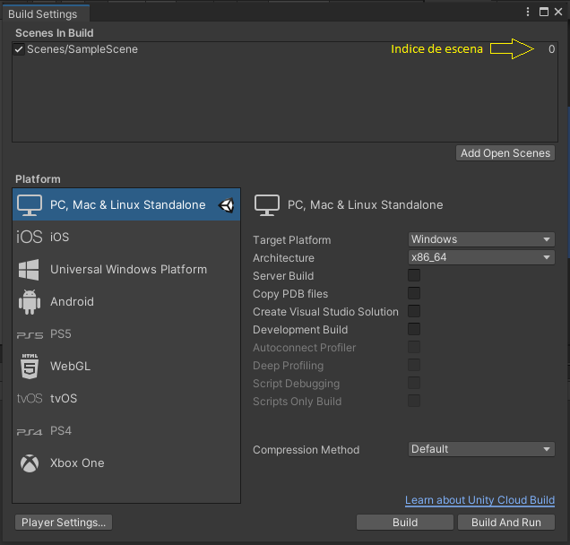

# Cosas interesantes para hacer con C#

La infinidad de cosas que podemos hacer con C# para darle vida a nuestros juegos, es infinita, el único límite que tenemos es la propia imaginación del desarrollador.

Por ello, en este capítulo, vamos a ver algunas cositas que podemos hacer, algunas serán bastante obvias, pero que seguramente se te puede venir al cerebelo esa pregunta tan puñetera, como es... `Y esto como lo hago???!!`. Pues bien, no sufras, que para eso estamos aquí.

## Como cambiar de escena

El cambio de escena en un juego, es algo muy rutinario, dado que cada escena representa o puede representar un nivel de nuestro juego, obviamente esto puede ser así, si tu juego va a tener varios niveles, en caso contrario, el cambio de escena, puede ser debido a que vayas a entrar en un sitio, presentar algo, el menú de juego es otra escena, los créditos, una fase bonus, todo eso son escenas.

Para que nos enteremos. Un juego está compuesto de escenas. Cuando tu le das a un botón por ejemplo, para abrir las preferencias del juego (ya sabes, eso tipico que te pone activar desactivar sonido, poner o quitar la música del juego, configurar los controles, etc) lo que estas haciendo es mostrar otra escena, que no necesariamente una escena tiene que ser solo y exclusivamente el Game Play del juego. Cada cosa que le muestras al usuario, está contenido en una escena, por ello, los cambios de escena es algo que se hacen continuamente. Espero que te haya quedado mas claro con esta explicación magistral que te acabo de dar.

Que nada, que como ya te he dicho, es un procedimiento rutinario, pero no por ello deja de ser importante.

Ah!!! Leches, que se  me olvidaba decirtelo. Cada escena, tiene asociado un número por Unity, el cual es un indice que indica cual escena, es cual. Por ejemplo, supongamos que tenemos la pantalla de inicio del juego, pues bien, digamos que es nuestra escena 0, mientras que la parte del gameplay del juego, podria ser perfectamente la escena 3, mientras que la escena de la ventanas de opciones del juego sería tranquilamente la dos.

Para ver el número asociado de cada escena, tenemos que dirigirnos en el menú principal de Unity a `File`->`Build Setting`. 

Ahí podremos ver en el apartado que pone **Scenes in Build**, todas las escenas que componen nuestro juego, y justamente al lado derecho, podremos ver el indice que nos indica que número de escena es. Antes de seguir, voy a comentar, que para añadir nuevas escenas, lo podemos hacer de dos formas.

* __Forma 1:__ Arrastramos desde el editor la escena que queramos añadir a `Scenes In Build`.
* __Forma 2:__ Haciendo click en el botón que vemos en Build Setting (`Add Open Scenes`).

A continuación vamos a ver un código, que permitirá realizar el cambio de escena en nuestro güego. "Al lio del montepío..."

