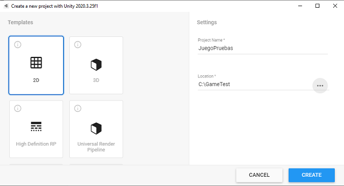
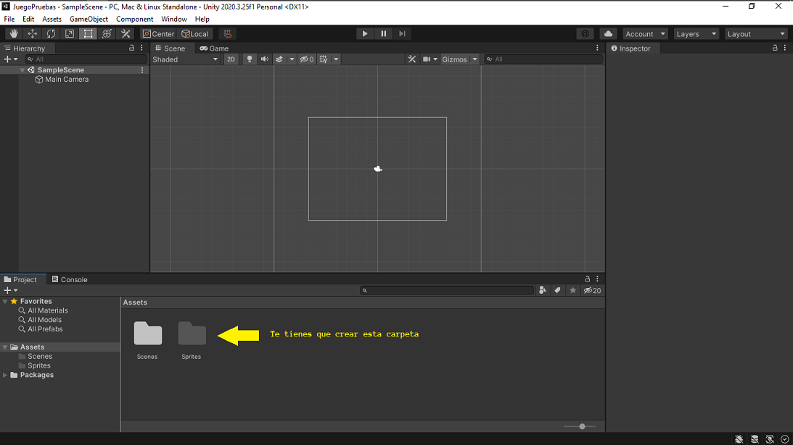
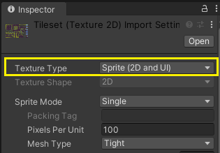
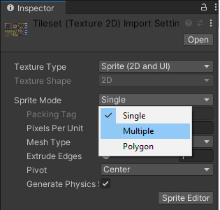
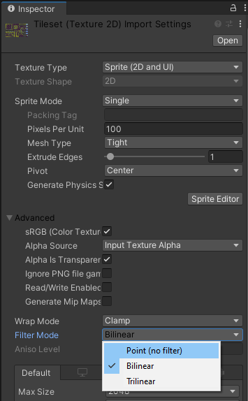
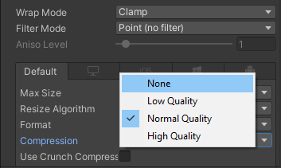

# Capítulo 12 - Haciendo cosas con Unity 

Si, ya se que me vas a decir que esto que estas leyendo va sobre programación C# en Unity y tal, y creeme, no te falta razón... es más, te la doy, pero ahora piensa... de que te sirve saber programar si no sabes montarte tu juego para ponerle esos `scripts` tan guapos que te estoy enseñando para hacer experimentos?? Eehh... Ahí le he dado. 

## Creación de nuestro primer escenario de juego

Pues bien, vamos a ver como se crea nuestro primer escenario.

Bien, para no complicar mucho la historia, de momento vamos a ver como hacerlo en 2D, que tiene su intringulis. Para ello vamos a ver lo siguiente:

* Crear nuestro `Tileset` para el juego.
* Crear nuestro `Tilemap`.

Bien, para que no te compliques mucho te voy a dar para que te descargues los [Tiles del Juego](../resources/Material_Juego_2D/tiles), asi que te voy a dar todo lo necesario para que te lo vayas montando. Asi que ya sabes, vete descargando los archivos que comenzamos (entiendo y asumo que tienes instalado Unity 3D, porque sino, no estamos haciendo nada).

Comenzemos.

Vamos a abrir nuestro Unity Hub y a crear un proyecto al que llamaremos "_JuegoPruebas_".

Seguidamente, cuando se nos abra Unity, crearemos la siguiente carpeta, a la que llamares `Sprites`.

En esa carpeta vas a poner el archivo que te has descargado antes. Bien lo puedes hacer arrastrando y soltando sobre la carpeta en Unity o bien, puedes importarlo.

Para importarlo simplemente ponte encima de la carpeta y haz click derecho con el ratón y se te abriar un menú. Dale a la opción que te pone `Import New Asset`, se te abrirá un cuadro de dialogo para que busques donde hayas puesto el archivo descargado, lo buscas, le das al botón que pone `Import` y listo. Yo mi recomendación es que lo arrastres a la carpeta, pero bueno, también puedes hacerlo así.

Pues bien, ya una vez que tenemos nuestro archivo con los `tiles`, lo siguiente que necesitamos es convertirlo para poderlo usar. Así que, vamos al lío.

1 - Nos vamos al panel `Proyect` y allí nos vamos dentro de la carpeta `Sprites`, hacemos un click encima del archivo y comprobamos en el panel `Inspector` que tiene la propiedad `Texture Type` como `Sprite (2D and UI)`.

2 - Seguidamente, en en el panel `Inspector` vamos a cambiar la propiedad `Sprite Mode` de `Single` a `Multiple`.

3 - En el panel `Inspector` cambiamos la propiedad `Filter Mode` de `Bilinear` a `Point (No Filter)`. A continuación, cambiamos la propiedad `Compression` de `Normal Quality` a `None`. Si nos sale un cuadro indicando aplicar cambios, por supuesto, decimos `Apply`.

