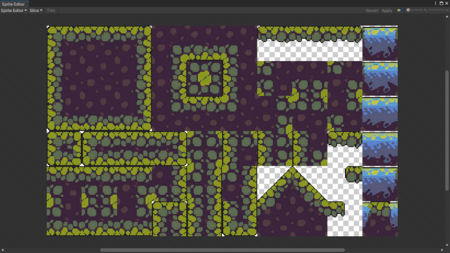
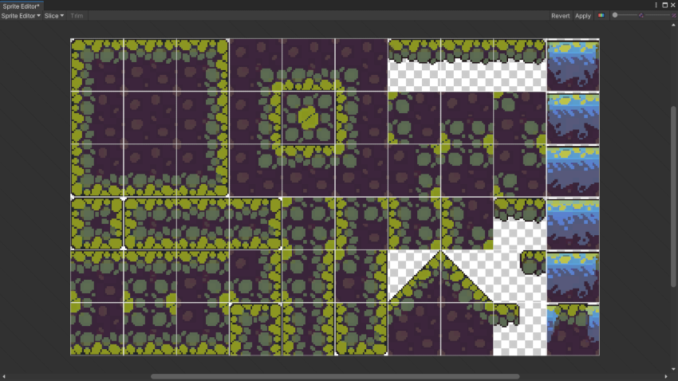
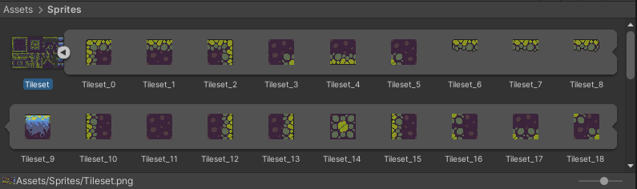
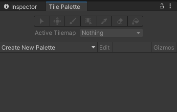
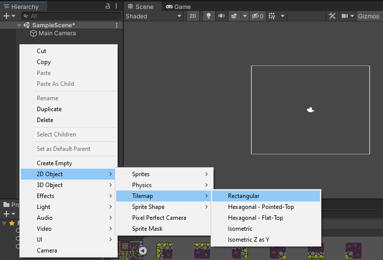
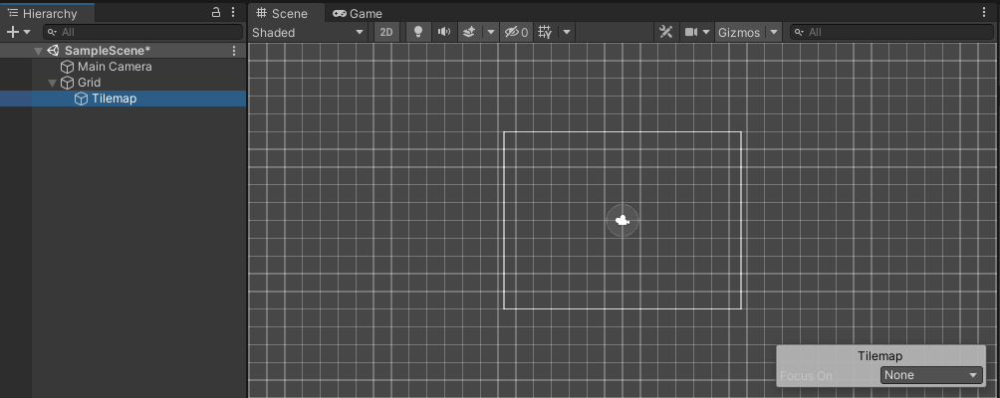
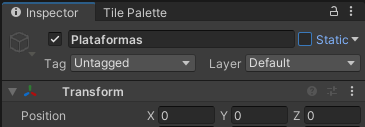
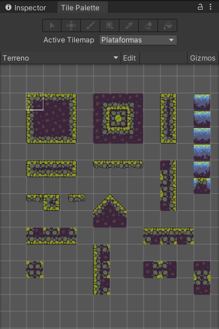
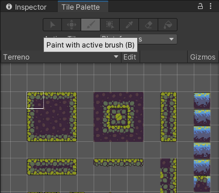

# Capítulo 12 - Haciendo cosas con Unity 

Si, ya se que me vas a decir que esto que estas leyendo va sobre programación C# en Unity y tal, y creeme, no te falta razón... es más, te la doy, pero ahora piensa... de que te sirve saber programar si no sabes montarte tu juego para ponerle esos `scripts` tan guapos que te estoy enseñando para hacer experimentos?? Eehh... Ahí le he dado. 

## Creación de nuestro primer escenario de juego

Pues bien, vamos a ver como se crea nuestro primer escenario.

Bien, para no complicar mucho la historia, de momento vamos a ver como hacerlo en 2D, que tiene su intringulis. Para ello vamos a ver lo siguiente:

* Crear nuestro `Tileset` para el juego.
* Crear nuestro `Tilemap`.

Bien, para que no te compliques mucho te voy a dar para que te descargues los [Tiles del Juego](../resources/Material_Juego_2D/tiles), asi que te voy a dar todo lo necesario para que te lo vayas montando. Asi que ya sabes, vete descargando los archivos que comenzamos (entiendo y asumo que tienes instalado Unity 3D, porque sino, no estamos haciendo nada).

Comenzemos.

Vamos a abrir nuestro Unity Hub y a crear un proyecto al que llamaremos "_JuegoPruebas_".

Seguidamente, cuando se nos abra Unity, crearemos la siguiente carpeta, a la que llamares `Sprites`.

En esa carpeta vas a poner el archivo que te has descargado antes. Bien lo puedes hacer arrastrando y soltando sobre la carpeta en Unity o bien, puedes importarlo.

Para importarlo simplemente ponte encima de la carpeta y haz click derecho con el ratón y se te abriar un menú. Dale a la opción que te pone `Import New Asset`, se te abrirá un cuadro de dialogo para que busques donde hayas puesto el archivo descargado, lo buscas, le das al botón que pone `Import` y listo. Yo mi recomendación es que lo arrastres a la carpeta, pero bueno, también puedes hacerlo así.

Pues bien, ya una vez que tenemos nuestro archivo con los `tiles`, lo siguiente que necesitamos es convertirlo para poderlo usar. Así que, vamos al lío.

1 - Nos vamos al panel `Proyect` y allí nos vamos dentro de la carpeta `Sprites`, hacemos un click encima del archivo y comprobamos en el panel `Inspector` que tiene la propiedad `Texture Type` como `Sprite (2D and UI)`.

2 - Seguidamente, en en el panel `Inspector` vamos a cambiar la propiedad `Sprite Mode` de `Single` a `Multiple`.

3 - En el panel `Inspector` cambiamos la propiedad `Filter Mode` de `Bilinear` a `Point (No Filter)`. 

4 - A continuación, cambiamos la propiedad `Compression` de `Normal Quality` a `None`. Si nos sale un cuadro indicando aplicar cambios, por supuesto, decimos `Apply`.

5 - Una vez hecho todo lo anterior, le damos al botón `Sprite Editor` del panel inspector y se nos abrira la siguiente ventana.

6 - Ahí le damos a donde pone `Slice` y se nos abre un desplegable, al cual vamos a cambiar los parámetros, tal y como te voy a comentar.
	
- Cambiamos el paràmetro `Type` de `Automatic` a `Grid By Cell Size`.
- En la propiedad `Pixel Size` introducimos los siguientes valores: `X` 32 e `Y` 32.
- Por último, le damos al boton que pone `Slice` y seguidamente tendremos que tener, algo parecido a esto.

- Y ya, simplemente en la ventana del `Sprite Editor`, le damos al botón de la esquina superior derecha que pone `Apply` y listo, ya podemos cerrar la venta del `Sprite Editor`.

Podemos ver en nuestra ventana `Proyect`, que se nos han creado fragmentos individuales con los `Sprites`. 

7 - A continuación, vamos a ir a la barra de herramientas, en `Window` -> `2D` y le damos a `Tile Palette`. Esta la ubicamos, en un sitio que sea comodo y accesible, yo en mi caso, lo he puesto asi.

8 - Lo siguiente que tenemos que hacer es, en nuestra ventana `Hierarchy`, le damos al botón derecho del ratón, para crear un nuevo `Tilemap` del siguiente modo.

Esto lo que nos va a hacer, es crearnos una rejilla en nuestra ventana de `Scene` donde iremos pintando nuestro mapa de juego, pero antes, debemos configurar unos cuantos de parámetros.

 - Primero y antes de nada, lo primero que vamos a hacer es cambiar el nombre de nuestro `Tile Map` al que pondremos `Plataformas`.
 

 - Lo siguiente es crear una nueva paleta, para ello, nos vamos a `Tile Palette` y le damos en `Create New Palette`, le damos como nombre `Terreno` y a continuación le damos a `Create`. A continuación, se nos abrirá una ventana, para indicarnos donde queremos guardar nuestra paleta, a lo que nosotros vamos a crear una carpeta dentro de la carpeta `Sprites` a la que le daremos de nombre `Palette`.

- Ahora lo siguiente que tenemos que hacer, es ir arrastrando hacia dentro de la ventana `Tile Palette`, cada uno de los `Tiles` que nos ha generado nuestro `Sprite Editor`, quedando algo parecido a esto.

- Pues bien, ya tenemos nuestra `Tile Palette` hecha, ahora solo nos queda seleccionar el pincel y a pintar tiles.

- La idea es que nos quede algo tal que asi.

