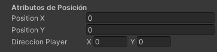
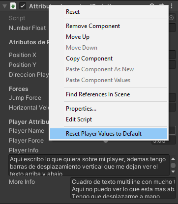

# Capítulo 12 - Atributos para personalizar el Inspector de Unity

Buenas, como estas mi querido aprendiz de mago. En este capítulo te quiero enseñer algunos atributos útiles para que a la hora de declarar tus variables en los `scripts` que crees, puedas personalizar un poco como se veran en el panel `Inspector`.

Si, ya se que es solo estética, pero ten en cuenta que cuanto mejor esté presentado lo que hagas, mucho mejor para ti y para el resto que tengan que usar alguno de tus códigos.

Aunque sin que caigas en la cuenta ahora, ya hemos usado uno de esos atributos para que se nos muestre una variable de clase por el `Inspecto`, obviamente no me refiero a ponerla como `public`, me refiero al atributo `[SerializeField]`, el cual lo que hacia era permitir ver en el panel de `Inspector` una variable privada. Pues bien, como el atributo `[SerializeField]` hay unos pocos mas, pero yo aquí solo te voy a exponer los mas utiles y que mas te pueden servir.

Atributos para personalizar el panel __Inspector__:
 
 * __SerializeField__
 * __Header__
 * __Space__
 * __Range__
 * __TextArea__
 * __Multiline__
 * __ContextMenu__
 * __ContextMenuItem__
 * __Tooltip__

## SerializeField

El atributo `SerializeField`, nos permite mostrar una variable de clase la cual puede ser privada, para poder acceder a sus valores desde el panel `Inspector`. Como sabemos, si una variable es de alcance `private`, nunca se mostrará en el panel `Inspector`, es por ello que si queremos acceder a esta para introducir valores o modificar estos, tendremos que emplear en su declaración el atributo `[SerializeField]`.

```c#
[SerializeField] float numeroFloat;
...
```


## Header

El atributo `Header` nos sirve para poner un texto de cabecera agrupando así varios campos en la ventana inspector. De esta manera, podemos agrupar un conjunto de campos que sean afines.

```c#
[Header("Atributos de Posición")]
[SerializeField] float positionX;
[SerializeField] float positionY;
[SerializeField] Vector2 direccionPlayer;
```



## Space

El atributo `Space`, lo que nos hace es dejar un hueco entre un conjunto de atributos, para asi ver con mas claridad los diferentes grupos que tengamos.

```c#
[SerializeField] float numeroFloat;

[Space]

[Header("Atributos de Posición")]
[SerializeField] float positionX;
[SerializeField] float positionY;
[SerializeField] Vector2 direccionPlayer;
```


## Range

El atributo `Range` nos muestra un deslizador el cual limita el rango mínimo y máximo de una variable numérica, impidiendo así salirnos con valores no definidos dentro de dicho rango.

```c#
[Header("Forces")]
[Range(1f, 50f)][SerializeField] float JumpForce = 10f;
[Range(150f, 500f)][SerializeField] float HorizontalVelocity = 180f;
```


## TextArea

El atributo `TextArea` nos muestra un cuadro de texto, el cual soporta la introducción de varias líneas de texto. Se suele usar normalmente cuando se quiere introducir una cadena de texto larga.

```c#
[Header("Player Attributes")]
[SerializeField] string playerName;
[Range(1f, 10f)][SerializeField] float playerForce;
[TextArea][SerializeField] string playerInfo;
```


Una curiosidad de `TextArea`, es que a medida que vamos añadiendo lineas de texto, aparecen barras de desplazamiento vertical.

## MultiLine

En esencia `Multiline` es similar a `TextArea`, con la salvedad que no nos aparecen barras de desplazamiento vertical a medida que vamos añadiendo lineas de texto.

Otra curiosidad de `Multiline`, es que si nos fijamos en `TextArea`, el cuadro de texto se situa debajo del nombre del identificador de la variable, pero en este caso, el cuadro de texto se nos situa al lado.

```c#
[Header("Player Attributes")]
[SerializeField] string playerName;
[Range(1f, 10f)][SerializeField] float playerForce;
[TextArea][SerializeField] string playerInfo;
[Multiline][SerializeField] string moreInfo;
```


## ContextMenu

El atributo `ContextMenu` nos permite añadir un menú contextual a nuestro código, el cual nos permitirá ejecutar una función que nosotros hayamos definido.

Una aplicación básica para este atributo podria ser, el establecer un valor de reset a los atributos de nuestro script.

```c#
[Header("Player Attributes")]
[SerializeField] string playerName;
[Range(1f, 10f)][SerializeField] float playerForce;
[TextArea][SerializeField] string playerInfo;
[Multiline][SerializeField] string moreInfo;

[ContextMenu("Reset Player Values to Default")]
void PlayerResetDefault()
{
	playerName = "Name";
	playerForce = 1f;
	playerInfo = "";
	moreInfo = "";
}
```



## ContextMenuItem

El atributo `ContextMenuItem` es muy similar a `ContextMenu`, con la salvedad que solo actua para una variable. La utilidad que podemos darle es por ejemplo el modificar valores de una variable concreta mediante incrementos.

```c#
[Header("Player Attributes")]
[SerializeField] string playerName;

[ContextMenuItem("Increase Force","IncForceFunction")]
[Range(1f, 10f)][SerializeField] float playerForce;
[TextArea][SerializeField] string playerInfo;
[Multiline][SerializeField] string moreInfo;

[ContextMenu("Reset Player Values to Default")]
void PlayerResetDefault()
{
	playerName = "Name";
	playerForce = 1f;
	playerInfo = "";
	moreInfo = "";
}

void IncForceFunction()
{
	playerForce *= 1.5f;
}
```


## Tooltip

El atributo `Tooltip`, nos muestra un texto de ayuda cuando nos situamos encima de un control.

```c#
[Header("Player Attributes")]
[SerializeField] string playerName;

[ContextMenuItem("Increase Force","IncForceFunction")]
[Tooltip("Fuerza que tendrá el jugador")]
[Range(1f, 10f)][SerializeField] float playerForce;
[TextArea][SerializeField] string playerInfo;
[Multiline][SerializeField] string moreInfo;

[ContextMenu("Reset Player Values to Default")]
void PlayerResetDefault()
{
	playerName = "Name";
	playerForce = 1f;
	playerInfo = "";
	moreInfo = "";
}

void IncForceFunction()
{
	playerForce *= 1.5f;
}
```


## Resumen

Como hemos visto, podemos añadir muchas cosas para personalizar a nuestro gusto el `Inspector` cuando hagamos un `script` de manera que sea mucho mas claro visualmente y mas flexible según nuestras necesidades. Asi que ya sabes, como siempre digo el límite está en la imaginación, pero algo realmente importante es la claridad en los controles que añadamos a nuestros juegos, ya que nos serán de gran ayuda a la hora de hacernos mucho mas facil nuestro trabajo.

Y hasta aquí se termina el capítulo de hoy mi joven amigo.
