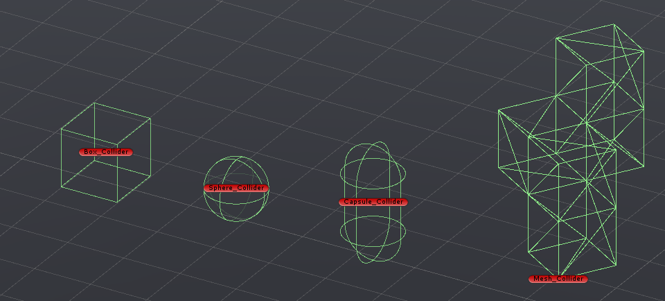
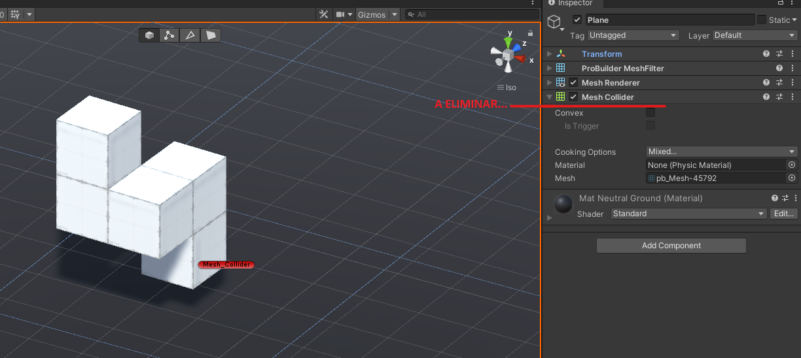
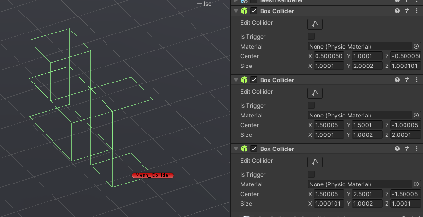
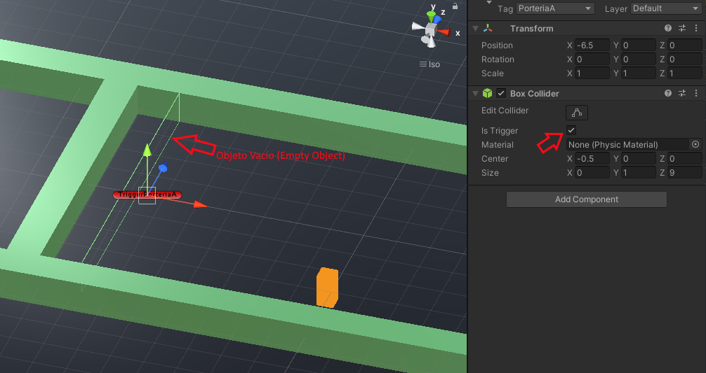

# Capítulo 1 - Físicas en Unity 3D

Que tal mi querido Einstein!! Hoy toca hablar de física... pero no cualquier física... no te voy a contar mierdas sobre la teoría de la relatividad, mecánica cuántica o la teoría de cuerdas. Te voy a contar sobre Física en Unity. Así que acomodate, pillate algo fresquito para meter al estomago, que arrancamos.

Una de las partes importantes de cualquier juego, es el uso y comportamiento de las físcias. Esto es basicamente todo aquello relacionado con la emulación de las caracteristicas físicas del mundo real (choques, velocidad, aceleración, grabedad, etc...).

Unity tiene un potente motor de físicas, el cual nos permite emular todo esto con relativa facilidad (tranquilo, que lo vamos a ver... o a caso te pensabas que esto habia terminado? Pues NO). Resumiendo todo un poco, podemos llegar a la conclusión, que en cualquier juego, por simple que sea, hay que tirar de físicas si o si, ya que una de las cosas mas importantes para controlar un juego o tener un cierto comportamiento, son las colisiones.

Pues bien, que me voy por las ramas. Como hemos visto antes, tenemos varios componentes que nos permiten hacer cosas o dotar de un comportamiento a un GameObject. Los dos que van a permitirnos que dicho `GameObject` tenga físicas van a ser dos:
 
 * El componente `Rigidbody`.
 * El componente `Collider`.

## El Componente Rigidbody

El componente `Rigidbody` es el que nos va a permitir simular comportamientos físicos en nuestro `GameObject`, permitiendo así a este último, el ser afectado por la gravedad o responder a las colisiones.

El componente `Rigidbody` tiene una serie de parámetros que serán los que modifiquemos para hacer que el objeto tenga una serie de caracteristicas físicas. A continuación vamos a enumerarlos y comentarlos brevemente, para posteriormente ampliar un poco mas sobre ellos.

 - **Mass**: Representa la masa del objeto en Kilos.
 - **Drag**: Es la resistencia al aire, cuando el objeto es movido al aplicar una fuerza. Gracias a el, el objeto podrá frenar su velocidad al aplicarle una fuerza lineal.
 - **Angular Drag**: Es la resistencia al aire cuando el objeto es girado por una fuerza.
 - **Use Gravity**: Permite que la gravedad afecte al objeto, si esta activada esta opción.
 - **Is Kinematic**: Si la opción está activada, las físicas del motor dejaran de afectar a nuestro `GameObject`, el cual solo podrá moverse, empleando su componente `Transform`.
 - **Interpolate**: Sirve para que cuando estemos usando físicas, al mover el objeto, notemos un comportamiento extraño, como por ejemplo ir a tirones o que vibra al desplazarse, podemos usarlo para suavizar esto. Este parámetro, tiene 3 valores que podemos aplicar:
     - **None**: Interpolación desactivada.
     - **Interpolate**: El movimiento será suavizado basandose en la posición del *Transform* del frame anterior.
     - **Extrapolate**: El movimiento será suavizado basandose en la posición del *Transform* del frame siguiente.
 - **Collision Detection**: Sirve para que los objetos que se mueven a mucha velocidad (mediante la aplicación de fuerzas físicas), no atraviesen otros objetos, al no detectar la colisión. Sus valores son:
     - **Discrete**[^1]: Es el valor por defecto, para detectar colisiones. Es utilizado para colisiones normales.
     - **Continuous**: Se detectarán colisiones para cualquier `Mesh Collider` que no tenga un `Rigidbody` y que se encuentre en la trayectoria del nuestro. También sirve, para evitar que otros `Rigidbodys` configurados con el modo `Continuous Dynamic` puedan atravesar nuestro `Rigidbody`
     - **Continuous Dynamic**[^2]: Se emplea para evitar que el objeto con el Rigidbody, pueda atravesar el `Mesh Collider` y a través de otros objetos con `Rigidbody` los cuales tienen configurada su `Collision Detection` como `Continuous`, cuando se mueven muy rápido. 
     - **Continuous Speculative**: 

 - **Constraints**: Se utiliza para aplicar restricciónes de movimiento y rotación a nuestro `Rigidbody`.
     - **Freeze Position**: Bloquea el movimiento del `Rigidbody` en los ejes que seleccionemos.
     - **Freeze Rotation**: Bloquea la rotación del `Rigidbody` en los ejes que seleccionemos.

Una vez que apliquemos el componente `Rigidbody` a un **GameObject** de nuestra escena, vamos a tratar con el mediante el uso de las físicas. Por ello, ya vamos a emplear el componente `Transform` para mover nuestro objeto, sino que haremos uso de las fuerzas y demás físicas para este y otros fines.

Como ya sabemos, para poder usar un componente, primero deberemos referenciarlo. Pues bien, con el caso de `Rigidbody` mas de lo mismo. 

Ya vimos con la parte de [Control de Componentes](cap07.md), al principio como acceder a un componente `Rigidbody`. Ahora vamos a ver una manera de hacerlo bien, para que en el caso de que al diseñador se le olvide referenciar al componente, el código lo haga por el y no nos de un fallo de `Null Reference`

```c#
public class RigidBodyReferencia : Monobehaviour
{
    [SerializeField] Rigidbody rb;
    //Aqui vendrian mas variables

    void Start()
    {
        if(rb == null) 
        {
            rb = GetComponent<Rigidbody>();
        }
        //Otras cosas a inicializar
    }

    //Mas codigo haciendo otras cosas
}
```

Bien, no voy a explicar al dedillo lo que hace esto, ya que en teoría, si estas aquí es que primero te has empapado bien la parte anterior sobre `Scripts` y si no, pues parate aquí y vete a leerte antes todo lo anterior relativo a `Scripts` en Unity y esos menesteres, y ya si eso cuando acabes, vuelve aquí para que te quede claro.

Pues bien, tal y como hemos visto en el código anterior, esta es una forma muy correcta de evitar que si el diseñador se olvida de referenciar el componente que nos interesa, directamente en la función `Start` lo comprobamos y se lo referenciamos.

No voy a entrar en detalle de como acceder a los atributos del `Rigidbody` pues es algo que vimos y que te he puesto antes al comienzo de este código. Te lo vuelvo a repetir... Si no te acuerdas, ve al enlace y echale un vistazo, Torpedin!!

Antes de seguir, te voy a dejar un [ejemplo](../scripts/ControlRigidBody.cs) de cosas que toquetear al `Rigidbody`, para que vayas viendo como se hacen cierto tipo de cosas.

## El Componente Collider

Este componente es el que va a definir el volumen o envoltura del objeto con el que otros objetos podrán colisionar, apoyarse o realizar otras acciones.

Los `Colliders` mas sencillos son:

 * Box Collider: El cual es una Caja (vamos a ser más tecnicos, un Hexaedro).
 * Sphere Collider: El cual es una esfera (Te has dado cuenta por el nombre eehh... si es que eres un crack!!)
 * Capsule Collider: El cual es una capsula.
 * Mesh Collider: El cual es una malla adaptada al volumen de un cuerpo irregular. (**Ojo con este tipo de collider, pues puede dar problema a la hora de detectar colisiones, si no tiene activado su parámetro CONVEX**).

 

Si nos fijamos en el `Mesh Collider` de la imagen, veremos que está formado por mogollon de caras, mallas y demas chascas. Si quisieramos resolver esto de una manera mas óptima, lo primero que hariamos sería eliminar el componente `Mesh Collider` y crear varios colliders mas simples para el mismo objeto.

Como dicen que una imagen vale mas que mil palabras, y yo estoy bastante vago para escribir, te lo voy a mostrar con imágenes.

 1 - La figura chunga en cuestión.

 

 2 - Eliminamos el `Mesh Collider` y creamos tres Box Colliders, vamos ajustando cada uno a la figura chunga hasta tener algo parecido a esto.
 
 

Asi ya de esta forma, nos vamos a quitar un montón de dolores de cabeza que nos puede dar el `Mesh Collider`.

Si bien es lo suyo usar colliders simples, habra veces que tendremos que recurrir a otras cosas como el `Mesh Collider`, pero si puedes, yo te recomiendo "Michael" que uses los colliders simples.

Bueno, que me enrollo... vamos a seguir.

Ahora vamos a ver como detectar colisiones desde el código, que aunque ya lo hemos visto de pasada en capítulos anteriores, ahora si le vamos a meter fuerte y flojo al tema. Por un lado, vamos a ver una serie de reglas "**OBLIGATORIAS**" a la hora de poder detectar colisiones mediante `script`, también vamos a ver como detectar colisiones o tratar colisiones mediante `Layers`.

Básicamente, hay dos reglas fundamentales que deben cumplirse para detectar colisiones:
 
 1 - Dos objetos tienen que tener añadido un `Rigidbody`.
 2 - Dos objetos tienen que tener añadido un `Collider`.

Estas dos reglas, son fundamentales si lo que queremos es detectar colisiones, ya que si no se cumple uno de los dos puntos, no vamos a poder ejecutar por código las acciones asociadas a la detección de colisiones.

Ya anteriormente, vimos algunas funciones para dectar colisiones. Cabe indicar, que en la detección de colisiones, hay tres acciones que se producen en una colision:

 - OnCollisionEnter: Esta se activa cuando se ha producido una colisión en ese Frame.
 - OnCollisionStay: Esta se activa una vez por Frame, mientras el objeto está colisionando con otro.
 - OnCollisionExit: Se activa, cuando la colisión ha terminado.

Vamos a poner un ejemplo de estos tres métodos:

```c#
//Aquí vendría código relativo a otras cosas que ahora no nos importan

void OnCollisionEnter(Collision collision)
{
    //El mensaje se lanzaría en el momento de colisionar
    Debug.Log("Se acaba de producir una colision");
}

void OnCollisionStay(Collision collision)
{
    //El mensaje se lanzaría mientras durase la colisión
    Debug.Log("Se está colisionando actualmente");
}

void OnCollisionExit(Collision collision)
{
    Debug.Log("Se ha terminado la colisión");
}
```

Este, sería un ejemplo muy básico de lanzar una acción en los diferentes estados de la colisión. Esto se puede complicar y extender tanto como queramos. Por ejemplo, podemos lanzar una explosión en el momento de colisionar, también podemos destruir un objeto, a la hora de salir de una colision o activar un mecanismo (trampa que mata, bicho que te persigue, etc...).

Debemos tener en cuenta una cosilla muy sencilla, que una colisión, es un evento que desencadena una serie de acciones. Metete esto muy bien en la sesera, pues es importante.

Bien, ya que hemos visto el evento de colisión y como manejar sus diferentes estados, vamos a ver el evento `Trigger`. Este es, otro evento de colisión, pero un poco particular. En el caso de las colisiones vistas antes, hemos dicho que deben tener un `Rigidbody` y un `Collider`, ¿Te acuerdas o no?, pues bien, esto es importante, ya que si un objeto no tuviera estos dos componentes, podría ser traspasado. Pues bien, el `Trigger` hace justamente esto, que un objeto sea traspasado, pero, en este caso concreto, los `triggers` se suelen aplicar a *objetos vacios*, los cuales no poseen `Rigidbody` y cuyo `collider` esta marcado como `Is Trigger`.

Tranqui colega, que si no te enteras, ahora te lo voy a explicar con fotos.



Si nos fijamos en la imagen, veremos el objeto que pone `TriggerPorteriaA`. Dicho elemento no es otra cosa que un `Empty Object` con un `Box Collider`, como se puede ver en el panel Inspector. Pues bien, si prestamos atención, veremos la casilla que está apuntada por la flecha roja y que pone `Is Trigger`. Esta es la que se le debe activar al `collider` del objeto vacio, para que se comporte como un trigger. Ya que si no está marcada la casilla, no se detectará el evento de colisión al ser traspasado.

La imagen anterior, corresponde a un ejemplo, donde el `Empty Object` se comporta como una porteria. Cuando un objeto, el cual vemos en la imagen en color naranja, que es el que porta el script, traspasa el objeto vacio, activará un evento controlado por el `trigger` el cual nos va a decir que hemos marcado gol en la porteria A.

Te voy a dejar aquí un fragmento del código que hace eso.

```c#
private void OnTriggerEnter(Collider other)
    {
        if (other.tag == "PorteriaA")
        {
            Debug.Log("Gol en la porteria A");
        }
        else if (other.tag == "PorteriaB")
        {
            Debug.Log("Gol en la porteria B");
        }
    }
```

Si prestamos atención al código de este ejemplo, veremos que, vamos a identificar el objeto `trigger` mediante su tag, el cual se lo habremos definido previamente. Así, de esta forma y mediante el uso de una condición `if`, podemos disparar una acción u otra, dependiendo del trigger que traspasemos.

Creo que se entiende hasta el momento como funcionan los `triggers` y los `colliders`, no Michael?? Bueno, espero si porque seguimos con mas colisiones que el Destruction Derby...


[^1]: Este modo de detectar las colisiones, es el más rapido y el que normalmente se usa.
[^2]: Este método de detectar colisiones es el mas lento y solo se deberá usar en objetos que se tengan que mover muy rápido
