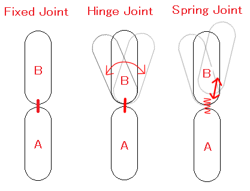
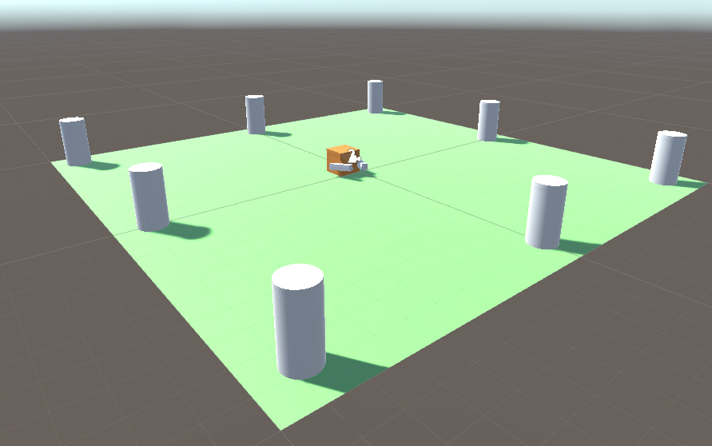
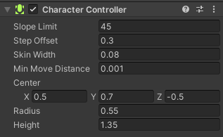

# Mas Física. Joint que te Joint y Character Controller

Bueno mi joven padawan, vamos a seguir ahora viendo mas sobre las físicas, dado que esto es lo que va a permitir dotar a nuestro juego de realismo y funcionalidad (por supuesto, siempre apoyados sobre nuestros Scripts, que son los que van a producir la autentica magia).

Como ya sabemos, una cosa fundamental de los juegos, es detectar colisiones, dado que gracias a estas, podemos saber si estamos sobre algo, si nos da algo o si le damos un impacto a algo (bala que mata a malo malote o malo malote que te mata a ti). Siendo un poco, o bastante pesado en esto, vuelvo a recalcar que para poder detectar colisiones es necesario tener dos cosas:

 - Rigidbody
 - Collider

Sin estos dos elementos, es imposible el poder detectar ninguna colisión usando el motor de físicas de Unity.

Bueno, vamos a dejar un rato las colisiones y vamos a empezar con una cosa nueva... Tatachiaaan!!! `Joints`.

## Joints

Bueno, vamos a ver, si vamos literalmente a la traducción de su significado al español, esto significa `Uniones`... Y para que sirven, que son exactamente, se comen...?? Voy a ir por partes, respondiendo a la última pregunta... No son comestibles, pero si son muy útiles. Sobre que son, pues bien, tal y como hemos dicho son uniones, basicamente lo que hacen es unir un objeto de tipo `Rigidbody` con otro o directamente a un punto que sea fijo, para esto se usan los componentes `Joint` los cuales sirven para dar una cierta libertad de movimiento al `Rigidbody` en cuestión.

Supongo que tu cerebrito habrá empezado a cabilar y a ver que se puede unir, que no, como cuando, que fue primero la gallina o el huevo?? Tranquilo, ahora te lo explico para que no tengas angustia existencial.

Unity dispone de varios tipos de `Joints` tanto para 3D como para 2D. Yo te voy a contar sobre los de 3D, pero básicamente los de 2D son iguales o casi iguales y su nombre de componente termina en 2D, no hay mucho que pensar.

Los tipos de `Joints` que tenemos son:

 - **Fixed Joint**: Este tipo de `Joint`, sirve para mantener unidos dos objetos. Este `joint` restringe el movimiento de un objeto al ser dependiente de otro. Obviamente, podemos conseguir que ambos objetos rompan la unión del `fixed joint` si se da un cierto suceso, como puede ser una colisión u otra cosa.
  En la [documentación de Unity](https://docs.unity3d.com/Manual/class-FixedJoint.html), podemos conocer todas las opciones de este tipo de unión. Aunque te pondré un ejemplito to guay para que lo pilles mejor.

 - **Hinge Joint**: Este `Joint` su traducción significa `Unión Bisagra`. Así que partiendo de esto, en definitiva lo que hace, es conectar a dos `Rigidbody` y limitar su movimiento como si estuvieran unidos por una bisagra. En mogollón de juegos se usan para puertas, pendulos de la muerte, cadenas, trampillas... en fin, en un montón de cosas. Y al igual que en el anterior, te voy a invitar a que te acostumbres a visitar la [documentación de Unity](https://docs.unity3d.com/Manual/class-HingeJoint.html), para saber que opciones tiene, que todo no te lo voy a dar mascado no??.

 - **Spring Joint**: Pues `Spring` es muelle en inglés, asi que esta unión se comporta como un muelle, ya está, así de simple. Te lo vuelvo a repetir, se que soy muy pesado, pero revisa la [documentación de Unity](https://docs.unity3d.com/Manual/class-SpringJoint.html) para enterarte bien de los parámetros de esta unión. Que si, que está en ingles. Pero es que en informática la gran mayoría de las cosas están en inglés, así que ya sabes, toca ponerse las pilas con el inglés o tirar del traductor de Google.

 - **Character Joint**: Aquí no te voy a traducir esto, y mejor te explico de que va esta unión. `Character Joint` básicamente su función es relajar completamente las articulaciones de un personaje 3D, haciendo el `efecto Ragdoll`[^1]. Y para que sirve? Pues un ejemplo sería cuando muere el personaje. Igualmente, puedes consultar toda su información, en la [documentación de Unity](https://docs.unity3d.com/Manual/class-CharacterJoint.html).

 - **Configurable Joint**: Este `joint` se usa para tocarle los bajos al motor de Unity para personalizar a tope el `joint`. No lo voy a explicar aquí, pero si te dejo un enlace a la [documentación de Unity](https://docs.unity3d.com/Manual/class-ConfigurableJoint.html), para que lo veas y conozcas mas en profundidad.

 Aquí te dejo algo que te va a resultar mas ilustrativo para acordarte de los principales `joints`.

 

## Character Controller

Y seguimos metiendo conceptos en tu cerebro, asi a cascoporro. Ahora es el turno del componente `Character Controller`.

Este componente básicamente es usado para los controles de jugador en tercera o primera persona y que no usa la física del `Rigidbody`. Nos va a permitir, configurar como se va a mover y comportar dicho movimiento del personaje, gracias a una serie de parámetros, los cuales van a limitar y modelar dicho comportamiento.

En esencia, el `Character Controller`, es simplemente una capsula con forma de `collider` a la que se le puede decir que se mueva en alguna dirección desde nuestro script. De este modo, el controller llevará a cabo el movimiento, el cual será limitado por las colisiones.

Una cosa que debemos tener presente, es que el `controller` no reacciona a fuerzas por sí mismo (ya te dije al principio, que no usaba físicas), por lo que si queremos aplicar fuerzas a otro objeto con el que coliones, deberemos hacerlos a través de código mediante la función `OnControllerColliderHit` (no te la voy a explicar ahora, pero puedes consultar la [documentación de Unity](https://docs.unity3d.com/es/2020.2/ScriptReference/30_search.html?q=OnControllerColliderHit) si tienes curiosidad).
Sus parámetros son:
  
 - **Slope Limit**: Indica el límite de inclinación de las pendientes, permitiendo que solo se puedan subir aquellas cuyo angulo de inclinación sea inferior al valor indicado.
 - **Step Offset**: Sirve para definir el desplazamiento del personaje asociado a su altura (*valores comprendidos entre 0.1 y 0.4 hacen referencia a un humano con una altura de 2m*).
 - **Skin Width**: Sirve para controlar el grado de intersección de dos colliders. Se suele recomendar, que este valor sea el 10% del radio asociado al collider. Valores altos de este parámetro, permiten controlar mejor las colisones, y los valores bajos puede ocasionar que el personaje se atasque en alguna deformación del terreno.
 - **Min Move Distance**: Sirve para definier la distancia mínima de movimiento. Si el player se mueve a una distancia menor que la indicada en este parámetro, no se moverá. Según Unity, se recomienda dejar este valor en 0.
 - **Center**: Posiciona el `collider` del `controller` con respecto a los ejes X, Y, Z.
 - **Radius**: Establece el radio del `capsule collider` del `controller`. El ancho del `collider`.
 - **Height**: Establece la altura del `capsule collider` del `controller`. Si modificamos este valor, el `collider` se escalara en ambos sentidos de Y (positivo y negativo).

Si somos un poco puristas, atenderemos a las recomendaciones que nos hace Unity en relación al uso de este componente, las cuales son:

 - *Ajustar la propiedad Skin Width si notamos que el objeto se queda atascado en el escenario*.
 - *Modificar la altura y radio para ajustar el `capsule collider` a la malla del personaje*.
 - *Se recomienda el uso de una altura de dos metros para el uso de personajes humanos*.
 - *No utilizar un valor excesivamente bajo para la propiedad `Slope Limit`*.

Yo se que todo esto que te acabo de soltar aquí en forma de losa marmorea, es bastante densote y que tu eres como yo, que te enteras mejor con un ejemplo. Tranquilo que te lo voy a poner, pero antes tenia que darte un poco de teoría para que le pilles el rollete, porque sino, por muchos ejemplos que te ponga, no le vas a pillar la esencia.

Sin mas dilación, vamos con el ejemplo.

Para este ejemplo, yo me he construido una escena en plan cutre con un cubo con algo que parecen brazos, en el cual he puesto la cámara principal como hija del cubo y así conseguir una visión en tercera persona, un plano para el suelo y unos cilindros imitando columnas para así a la hora de mover el cubo apreciar mejor el movimiento de este. En definitiva, esto de aquí.



Pues bien; con esto ya tenemos mas que de sobra para probar nuestro `Character Controller`. 

Primero y antes de darle vida a nuestro cubo, le he añadido el componente `Character Controller` con sus opciones configuradas tal que así.



Y para rematar, he hecho el siguiente script:

```c#
using System.Collections;
using System.Collections.Generic;
using UnityEngine;

public class ChControllerScript : MonoBehaviour
{
    [SerializeField] CharacterController controller;
    [SerializeField] float speed;
    Vector3 movimiento;
    
    void Awake()
    {
        controller = GetComponent<CharacterController>();
    }

    
    void Update()
    {
        movimiento = new Vector3(Input.GetAxis("Horizontal") * speed, 0, Input.GetAxis("Vertical") * speed);
        controller.Move(movimiento * Time.deltaTime);
    }
}
```

Si te fijas mi joven aprendiz, verás que el script en si no tiene mucho. Primero y antes que nada hemos referenciado al `CharacterController` y en el método `Update` he ido asignando a la variable **movimiento**, la cual es un *Vector3* donde vamos actualizando sus posiciones en X,Z mediante el valor devuelto por la entrada `Input Horizontal` e `Input Vertical`, ambas multiplicadas por la variable de *speed*, la cual la ajustaremos desde el editor de Unity. 

Por último, pasamos el valor del Vector3 `movimiento` y lo multiplicamos por `deltaTime` para ir actualizando la posición frame a frame.

Como veras, ha sido relativamente simple el aplicar movimiento mediante nuestro nuevo componente `Character Controller`.

Y bueno, hasta aquí el capítulo de hoy, espero que te haya resultado util y didactico Michael. Se que ha sido un pelín largo, con mucha literatura y pocos dibujos, pero chato, que quieres... esto es así, si tuviera mas dibujos, sería un comic. De todas formas, lo que mas importa es que hayas pillado bien todo esto. Ya en tu mano dejo, el pensar en que o como usarlo, eso es cosa tuya y de tu imaginación Michael, mi misión es enseñarte el camino y en tí está recorrerlo.


[^1]: Efecto que se utiliza para animar de forma no manual a personajes, generalmente cuando mueren. Sirve para darles un efecto como de muñeco de trapo, de manera que al caer muertos, caigan de diferentes maneras. Un ejemplo de esto, lo podemos ver en las muertes de los personajes de los juegos GTA a partir del IV.