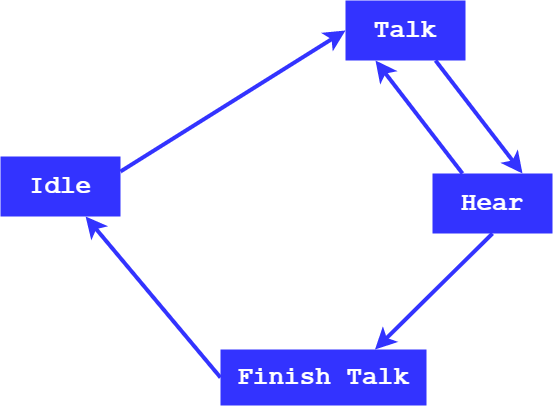
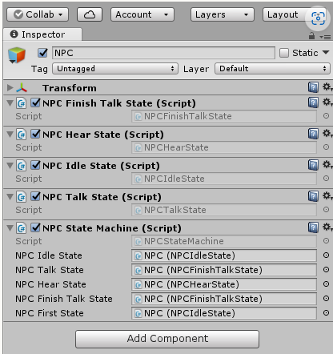

# Capítulo 3 - Máquina de Estados
No te asustes que tampoco es tan dificil y veras como con un poco que te cuente, lo pillas rápido, así que vamos a ello.

## Máquina de Estados (Definición y Usos)
Una máquina de estados, no es el gobierno ese que los mas conspiranoicos dice que controlan a los paises en la sobra, no... quizas eso sería mas divertido, pero no es es el caso. En fin, que me voy por las ramas.

 Una __máquina de estados__ es una función que se emplea para **controlar el código en tiempo de ejecución**.

 A ver, seguro que estas preguntando, eso no lo hace el compilador?? - Respuesta: NO, ESTO ES OTRA COSA.

 El uso de `máquina de estados` está muy extendido, esto se debe a su buena estructuración y a su capacidad de separar acciones de forma ordenada, de manera que facilita el entendimiento para futuras depuraciones o ampliación del código.

 Y tu te estarás diciendo <SI, TODO ESO ESTA MUY BIEN, PERO PARA EN VIDEOJUEGOS PARA QUE LA PUEDO USAR??>. Bueno, tranqui tronco, que ahí quiero llegar.

 En videojuegos, la máquina de estados, es usa por norma general para __crear una inteligencia artificial de enemigos o para personajes secundarios__. Si! vamos a crear a SkyNet... (_en realidad no... no lo flipes tan pronto_).

 Vamos a ver como podemos implementar una máquina de estados sencillita, y pares vamos a poner un ejemplito to´ guapo de esos que te pongo.

---
 ### Estructura de Una Máquina de Estados

 La máquina de estados que vamos a crear, básicamente tendrá la siguiente forma:


 

 Este será el diagrama de estados que vamos a realizar. Facilito y sin pretensiones.

 Para que lo entiendas mas claro, te voy a explicar que vamos a hacer. Nuestra máquina de estados estará destinada a un NPC, el cual estará parado en reposo, que puede pasar a un estado de hablar o a escuchar.

 Pues bien, para crear la maquina de estados, tendremos primero que crear un _script_ que representará a la máquina de estados, y tantos _scripts_ como los estados que hemos definido. En resumen, deberemos crear los siguiente scripts:

 * `NPCStatesMachine.cs`
 * `NPCIdleState.cs`
 * `NPCTalkState.cs`
 * `NPCHearState.cs`
 * `NPCFinishTalkState.cs`

 Cada uno de estos scripts, deberán ser añadidos como componentes dentro de nuestros NPC's (__"Non Player Controller"__ personajes dentro del juego que no son controlables, vamos los secundarios que estan por ahí dentro del juego), bien dentro de un GameObject de la escena o en un __prefab__, por si lo queremos instanciar en tiempo de ejecución.

 Bueno, vamos al lio. Vamos a centrarnos en el primer script, en el de la máquina de estados propiamente dicho. Aquí debemos incluir el resto de scripts como variables de clase, pero en lugar de asignarles su propio tipo, vamos a asignarles el de la clase padre __MonoBehaviour__. Esto es necesario, para que los scripts puedan ser tratados como componentes de un _GameObject_ de Unity.

 Lo siguiente que vamos a hacer, es crear __dos nuevas variables__, también de la clase _MonoBehaviour_, en el script de __NPCStateMachine.cs__. La primera variable la llamaremos __NPCActualState__, y la segunda __NPCFirstState__. Estas dos variables no servirán para indicar el estado actual e inicial del NPC. De estar forma, el primero de estos dos nuevos _scripts_ irá cambiando a medida que el juego se vaya desarrollando, mientras que el NPC interactuará con el objeto _Player_ que será el que nosotros controlemos.

 En fin, la cabecera del script, nos quedaria de momento así:

 ```c#
  public class NPCStateMachine : MonoBehaviour
  {
     public MonoBehaviour NPCIdleState; 
     public MonoBehaviour NPCTalkState;
     public MonoBehaviour NPCHearState;
     public MonoBehaviour NPCFinishTalkState;
     MonoBehaviour NPCActualState;
     public NPCFirstState;

     ...
  }
 ```

 El motivo de que las cuatro variables iniciales asi como las dos nuevas sean de tipo _MonoBehaviour_, se basa en que estas dos últimas no están relacionadas con los scripts que hemos creado, asi que adoptarán temporalmente el valor de las primeras, dicho de otra forma, `NPCActualState` a veces tomará el valor de `NPCIdleState`, `NPCTalkState`, etc... Por otro lado, la variable `NPCActualState` deberà ser privada, para evitar acceder a ella de manera accidental desde una clase distinta.

 La forma en la que quedaría el conjunto de componentes del NPC, sería la siguiente:

 

 Ahora vamos a crear una función pública en el script de `NPCStateMachine`, que se encargarà de gestionar o modificar el estado actual del personaje. Esta función será públic para que sea accesible desde las clases externas a la declarada, y además, se ingresará desde los _scripts_ que estamos mencionando y que coinciden con los estados que hemos indicado.

 Por tanto, nuestra clase `NPCStateMachine` quedará del siguiente modo:

 ```c#
  public class NPCStateMachine : MonoBehaviour
  {
     public MonoBehaviour NPCIdleState; 
     public MonoBehaviour NPCTalkState;
     public MonoBehaviour NPCHearState;
     public MonoBehaviour NPCFinishTalkState;
     MonoBehaviour NPCActualState;
     public MonoBehaviour NPCFirstState;

     public void ChangeState(MonoBehaviour newState)
     {
       if(NPCActualState != null)
       {
         NPCActualState.enabled = false;
       }
       NPCActualState = newState;
       NPCActualState.enabled = true;
     }
  }
 ``` 

 La finalidad de la función es, cambiar de estado cuando así lo indiquemos mediante un parámetro de entrada que será asignado a la variable `NPCActualState`, activando dicho componente tras desactivar el anterior. La condición del `if` servirá para la ejecución inicial, ya que al no poseer `NPCActualState` ningún valor, obtendríamos un error.

 Por si no queda claro aun como va todo esto, vamos a ver un ejemplo para entender todo este sistema, lo que viene siendo, como realizar las llamadas a la función `ChangeState`, desde los diferentes scripts para que cambie el estado actual. Para eso, vamos a suponer que nos encontramos en el script `NPCIdleState`, que tendrá un cierto código que realizará las distintas acciones del NPC en reposo (gestión de animaciones, sonidos, etc), además del código necesario para poder detectar cuando pasar al siguiente estado. Para hacer esto que acabo de contarte, el script va a necesitar lo siguiente:

 ```c#
 public class NPCIdleState : MonoBehaviour
 {
   ...
   //Aqui habra variables de clase para fines especificos

   void Awake()
   {
     StateMachie = GetComponent<NPCStateMachine>();
   }

   ...
   //Otras funciones especificas

   void checkStartToSpeak()
   {
     StateMachine.ChangeState(NPCTalkState);
   }

   ...
   //Resto de funciones de la clase
 }
 ```

 Así de este modo, conseguiremos que todos los scripts del NPC permanezcan desactivados a excepción del `NPCTalkState` y el `NPCSateMachine`, pasando de esa forma a otra nueva fase de comportamiento. `NPCTalkState` también dispondrá de otro método que llame a `ChangeState` de nuevo para poder acceder a otro estado, creando de ese modo, una cadena de posibles camino además de una simple y básica inteligencia artificial.