# 01 - Tiles y Sprites

Que es esto de los `Tiles`, basicamente entiendelo como pequeños fragmentos de imagen con la que vas a construir tu escenario de juego, son como los ladrillos para construir una casa. Y los `Sprites`, simplemente son imagenes que van a representar a nuestro jugador o los enemigos. Pero bueno, tu tranquilo, que ya te enteraras de todo esto al terminar esta parte y lo tendras super clarito. Animo campeón, que tu puedes.

## Creación de nuestro primer escenario de juego

Pues bien, vamos a ver como se crea nuestro primer escenario.

Bien, para no complicar mucho la historia, de momento vamos a ver como hacerlo en 2D, que tiene su intringulis. Para ello vamos a ver lo siguiente:

* Crear nuestro `Tileset` para el juego.
* Crear nuestro `Tilemap`.

Bien, para que no te compliques mucho te voy a dar para que te descargues los [Tiles del Juego](../resources/Material_Juego_2D/tiles), asi que te voy a dar todo lo necesario para que te lo vayas montando. Asi que ya sabes, vete descargando los archivos que comenzamos (entiendo y asumo que tienes instalado Unity 3D, porque sino, no estamos haciendo nada).

Comenzemos.

Vamos a abrir nuestro Unity Hub y a crear un proyecto al que llamaremos "_JuegoPruebas_".

Seguidamente, cuando se nos abra Unity, crearemos la siguiente carpeta, a la que llamares `Sprites`.

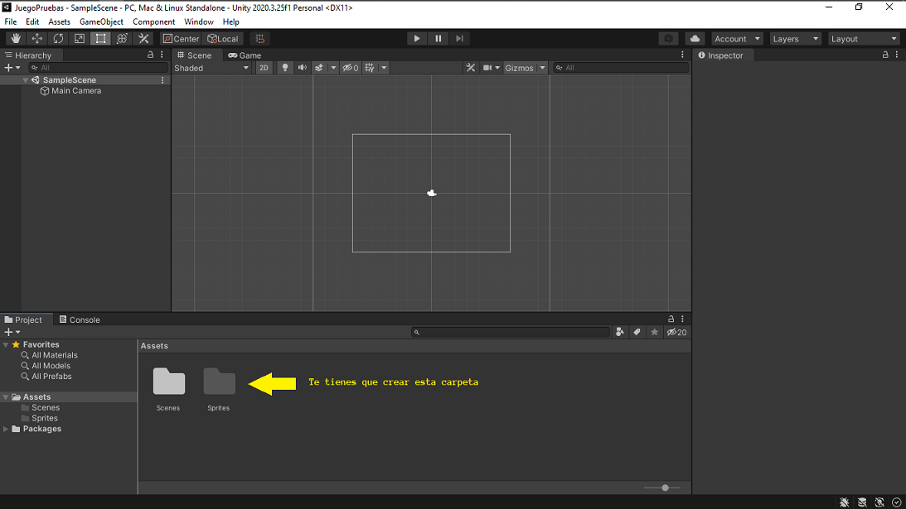

En esa carpeta vas a poner el archivo que te has descargado antes. Bien lo puedes hacer arrastrando y soltando sobre la carpeta en Unity o bien, puedes importarlo.

Para importarlo simplemente ponte encima de la carpeta y haz click derecho con el ratón y se te abriar un menú. Dale a la opción que te pone `Import New Asset`, se te abrirá un cuadro de dialogo para que busques donde hayas puesto el archivo descargado, lo buscas, le das al botón que pone `Import` y listo. Yo mi recomendación es que lo arrastres a la carpeta, pero bueno, también puedes hacerlo así.

Pues bien, ya una vez que tenemos nuestro archivo con los `tiles`, lo siguiente que necesitamos es convertirlo para poderlo usar. Así que, vamos al lío.

1 - Nos vamos al panel `Proyect` y allí nos vamos dentro de la carpeta `Sprites`, hacemos un click encima del archivo y comprobamos en el panel `Inspector` que tiene la propiedad `Texture Type` como `Sprite (2D and UI)`.

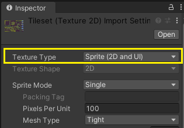

2 - Seguidamente, en en el panel `Inspector` vamos a cambiar la propiedad `Sprite Mode` de `Single` a `Multiple`.

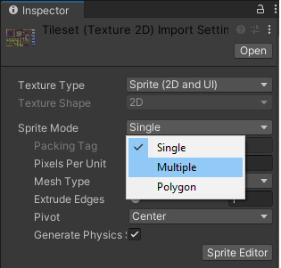

3 - En el panel `Inspector` cambiamos la propiedad `Filter Mode` de `Bilinear` a `Point (No Filter)`. 

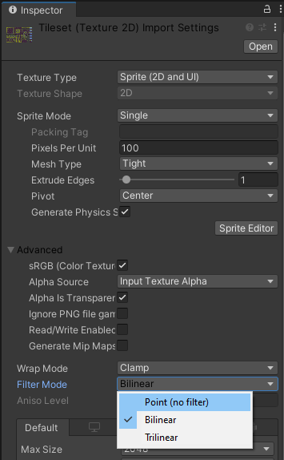

4 - A continuación, cambiamos la propiedad `Compression` de `Normal Quality` a `None`. Si nos sale un cuadro indicando aplicar cambios, por supuesto, decimos `Apply`.

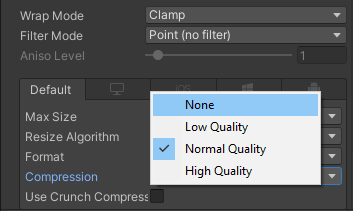

5 - Una vez hecho todo lo anterior, le damos al botón `Sprite Editor` del panel inspector y se nos abrira la siguiente ventana.

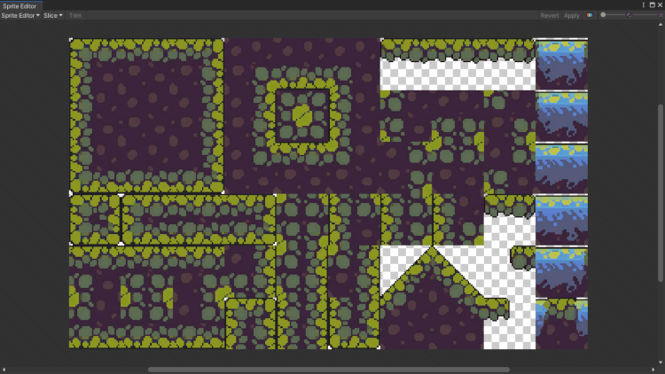

6 - Ahí le damos a donde pone `Slice` y se nos abre un desplegable, al cual vamos a cambiar los parámetros, tal y como te voy a comentar.
	
- Cambiamos el paràmetro `Type` de `Automatic` a `Grid By Cell Size`.
- En la propiedad `Pixel Size` introducimos los siguientes valores: `X` 32 e `Y` 32.
- Por último, le damos al boton que pone `Slice` y seguidamente tendremos que tener, algo parecido a esto.

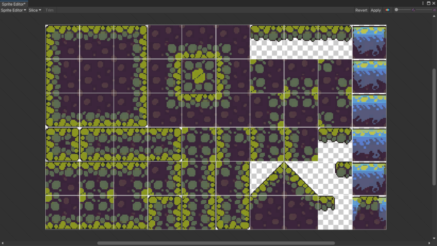

- Y ya, simplemente en la ventana del `Sprite Editor`, le damos al botón de la esquina superior derecha que pone `Apply` y listo, ya podemos cerrar la venta del `Sprite Editor`.

Podemos ver en nuestra ventana `Proyect`, que se nos han creado fragmentos individuales con los `Sprites`. 

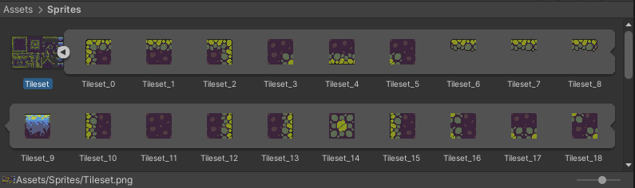

7 - A continuación, vamos a ir a la barra de herramientas, en `Window` -> `2D` y le damos a `Tile Palette`. Esta la ubicamos, en un sitio que sea comodo y accesible, yo en mi caso, lo he puesto asi.

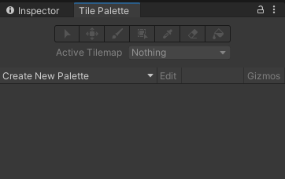

8 - Lo siguiente que tenemos que hacer es, en nuestra ventana `Hierarchy`, le damos al botón derecho del ratón, para crear un nuevo `Tilemap` del siguiente modo.

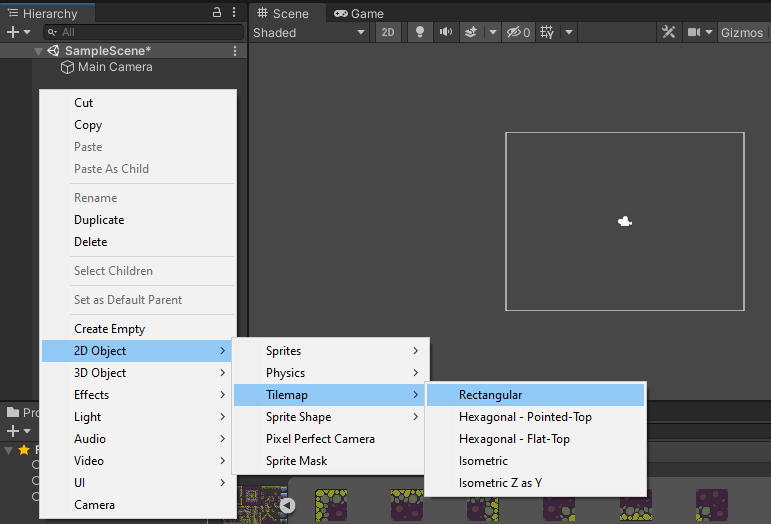

Esto lo que nos va a hacer, es crearnos una rejilla en nuestra ventana de `Scene` donde iremos pintando nuestro mapa de juego, pero antes, debemos configurar unos cuantos de parámetros.

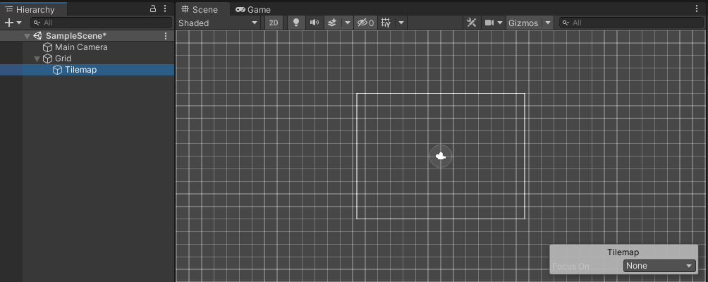

 - Primero y antes de nada, lo primero que vamos a hacer es cambiar el nombre de nuestro `Tile Map` al que pondremos `Plataformas`.
 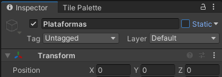

 - Lo siguiente es crear una nueva paleta, para ello, nos vamos a `Tile Palette` y le damos en `Create New Palette`, le damos como nombre `Terreno` y a continuación le damos a `Create`. A continuación, se nos abrirá una ventana, para indicarnos donde queremos guardar nuestra paleta, a lo que nosotros vamos a crear una carpeta dentro de la carpeta `Sprites` a la que le daremos de nombre `Palette`.

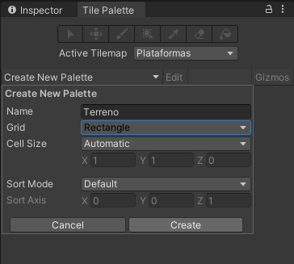

- Ahora lo siguiente que tenemos que hacer, es ir arrastrando hacia dentro de la ventana `Tile Palette`, cada uno de los `Tiles` que nos ha generado nuestro `Sprite Editor`, quedando algo parecido a esto.

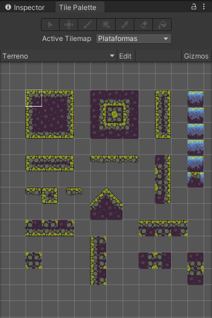

- Pues bien, ya tenemos nuestra `Tile Palette` hecha, ahora solo nos queda seleccionar el pincel y a pintar tiles.

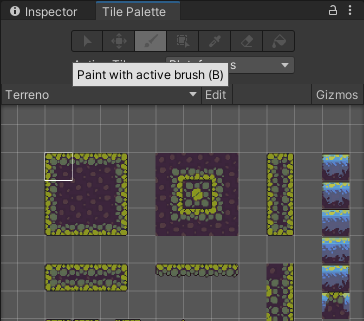

- La idea es que nos quede algo tal que asi.

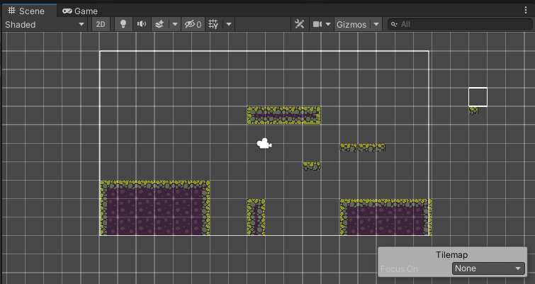

9 - Ahora lo siguiente que tenemos que hacer es ponerle a nuestro terreno un `Collider`, para ello seleccionamos en nuestro panel `Hierarchy`, el objeto `Plataformas` y seguidamente vamos al panel `Inspector`, para añadir un nuevo componente, concretamente un `Tilemap Collider 2D`, para ello le damos en `Add Component` en el panel `Inspector` y buscamos `Tilemap Collider 2D`.

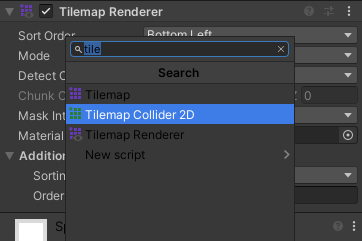

10 - Una vez añadido el `Tilemap Collider 2D`, tenemos que añadir tambien un `Composite Collider`, del mismo modo que añadimos el `Tilemap Collider 2D`. Una vez añadido este, nos vamos al componente `Tilemap Collider 2D`, en nuestro panel `Inspector` y le marcamos la casilla `Used by Composite`.

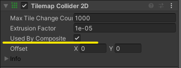

11 - Otra cosa que debemos hacer es, si nos hemos fijado, al añadir el `Composite Collider`, se nos ha añadido un componente `Rigidbody 2D`, pues es en este donde tenemos que cambier la propiedad `Body Type`, la cual nos viene como `Dinamic` por defecto, la vamos a cambiar a `Kinematic`. Ya que si la dejamos como `Dinamic`, todo nuestro mapa se ira a por tabaco cuando le demos al play (dale al play sin miedo para verlo... tranqui, que no pasa nada, cuando detengas el play todo vuelve a su sitio).

12 - Vamos a colocar muestro muñeco del player, para ello, vamos a importar dos archivos uno para el [PlayerIdle](../resources/Material_Juego_2D/sprites/PlayerIdle.png) y el otro [PlayerWalking](../resources/Material_Juego_2D/sprites/PlayerWalking.png). Y una vez importados, vamos a hacer un par de cosas previas. Esto que te voy a explicar, lo voy a hacer sobre el `PlayerIdle`, asi que, quedate con la copla, que es lo mismo que tienes que hacer con el otro, o con el resto de `Sprites` de moñecos que vayas a tener en tu güego. Al lio...

 - Hacemos click con el ratón sobre `PlayerIdle` y tal y como hicimos con los `Tiles`, vamos al panel `Inspector`, cambiamos `Sprite Mode` de `Single` a `Multiple`, `Filter Model` de `Bilinear` a `Point (No Filter)` y `Compresion` de `Normal Quality` a `None` (Aquí no te pongo imagenes, porque es lo mismo que hicimos con los `Tiles` y si no te acuerdas, tira un poco mas arriba y veras todo esto). Una vez hecho esto, nos vamos abajo de los __Componentes__ y damos `Apply`. Posteriormente le damos al boton de `Sprite Editor`.

 - A continuación, vamos a recortar nuestros `Sprites`, para ello, hacemos igual. Le damos a `Slice`, seleccionamos `Grid By Cell Size` y como valores para __Pixel Size__ damos, para `X` 20 y para `Y` 24. Le damos a `Slice` y nos hará los recortes. Ahora nos toca ir eliminando los recortes sobre los huecos vacios y ajustando la posición de los recortes en nuesetro moñeco, hasta dejar algo como esto.
 
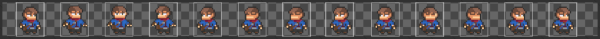

 - Ya antes de terminar con nuestro personaje, seleccionamos dentro de nuestro panel `Proyect` el archivo `PlayerIdle` y nos vamos al `Inspector` y ajustamos la propiedad `Pixel Per Unit`, la cual estará en 100 por defecto, a lo que lo cambiamos por 20. Y una vez hecho esto, vamos abajo de `Inspector` y aplicamos los cambios.

 - Ahora ya podemos poner a nuestro personaje en el juego, para ello solamente nos vamos al archivo `PlayerIdle` de nuestro panel `Proyect`, los desplegamos para ver los `Sprites` que hemos recortado y arrastramos el primero hacia nuestra escena y lo ponemos tal que asi.

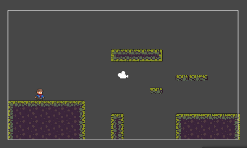