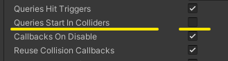

# Movimiento, salto y comprobación de colisiones

Agarrate que vienen curvas... 

En esta parte ya vamos a empezar a escribir código para programar a nuestro "moñeco" para que haga algo, que ahí parado nos queda muy aburrido y si no se mueve, que mierda de juego es este... (Nota mental... Se me ocurre un juego con eso...).

Pues bien, como hemos dicho, ya aquí vamos a empezar a programar para poder hacer cosas, toma lapiz y papel que te voy a dar una explicación magistral, mi joven discípulo.

## Preparando las cosas para mover al muñeco

Comenzemos por crear una carpeta dentro de nuestro proyecto a la que pondremos el nombre de `Scripts`. En ella vamos a guardar nuestros __Scripts__ los cuales van a conseguir que nuestro juego cobre vida. 

De momento y para empezar, vamos a crear el primero de todos ellos, para mover a nuestro "moñeco". Pues bien, ya tienes la carpeta creada (entiendo que eres un buen chico y la has creado cuando te lo he dicho no...???? En caso contrario, ya estas tardando en crearla), nos vamos dentro de ella y con el boton derecho del raton dentro de la carpeta, le damos a `Create` -> `C# Script` y nos creara un archivo C# que serà donde pongamos nuestro script. A este archivo lo vamos a llamar `PlayerController`. 

Muy importante!! Debemos cargar a nuestro personaje, un componente `Rigidbody2D` que será el que nos sirva para moverlo y hacer otras cosas, asi que si aun no lo tiene, ponselo.

Ya aplicado el `Rigidbody2D` a nuestro Player, donde pone `Constraints` abrimos y marcamos la casilla que pone `Z`. De este modo, bloqueamos cualquier giro o rotación del personaje. Esto es muy importante, porque sino, el muñeco se pondrá a hacer cosas rarisimas.


Aun no tenemos del todo preparado a nuestro querido amigo, asi que lo siguiente que vamos a hacer, es añadirle un `Capsule Collider 2D`, asi que ya sabes, ponselo para que no se caiga.

Además, vamos a ajustar el `Collider` que le hemos puesto a nuestro player, para ello hacemos click en `Edit Collider`.


Ajustaremos el `Collider` del player, para que nos quede algo parecido a esto.


Una vez hecho todo lo anterior, nos vamos a la carpeta `Scripts`, seleccionamos nuestro archivo y hacemos doble click o le damos a Intro para que nos abra `Visual Studio` y aquí es donde vamos a hacer cosicas ya para mover al "moñeco". Y aquí es donde empieza el Rock 'n' Roll.

### Preparando propiedades y métodos

Lo primero que vamos a crear, son una serie de propiedades, las cuales nos van a servir para poder mover inicialmente a nuestro personaje horizontalmente.

Para ello vamos a crear dos propiedades:

 - La primera para ajustar la velocidad a la que se va a mover el personaje.
 - La segunda será para refernciar el `Rigidbody` de este.

```c#
public class PlayerController : MonoBehaviour
{
    [SerializeField] float velocity;
    Rigidbody2D rbPlayer;

```

Lo siguiente que tenemos que hacer es referenciar al `Rigidbody2D` de nuestro Player. Para ello haremos lo siguiente. Dentro del método `Star`, vamos a asignar nuestra variable `rbPlayer`, la cual la definimos anteriormente y mediante `GetComponent` vamos a acceder al componente `Rigidbody2D` de nuestro Player.

```c#
public class PlayerController : MonoBehaviour
{
    [SerializeField] float velocity;	//Para la velocidad de movimiento horizontal
    Rigidbody2D rbPlayer;		//Para referenciar el Rigidbody2D del player

	private void Start()
    {
    	//Referenciamos el Rigidbody2D del player
        rbPlayer = gameObject.GetComponent<Rigidbody2D>();
    }
```


## Moviendo el Personaje

A continuación, lo siguiente que tenemos que hacer, es crear una función para mover horizontalmente a nuestro Player. Así que vamos a crear un método privado al que vamos a llamar `MoveHorizontalPlayer`, el cual basicamente lo va a hacer es aplicar una fuerza horizontal al personaje para moverlo por el terreno. Asi que, sin mas dilación vamos a definir nuestra función.

```c#
void MoveHorizontalPlayer()
    {
        //Aplicamos una fuerza para desplazar al personaje horizontalmente
        rbPlayer.AddForce(Vector2.right * velocity * Input.GetAxisRaw("Horizontal") * Time.deltaTime);
    }
```

Antes de continuar, vamos a explicar un poco que hace esta función.

En primer lugar, accedemos al método `AddForce` del `Rigidbody2D` de nuestro player, al que hemos llamado `rbPlayer`. Despues, le pasamos como parámetros una ristra que basicamente lo que hace es:

 - Un `Vector2.right` que lo que hace es indicar que el desplazamiento será en sentido horizontal.
 - Multiplicamos lo anterior por la propiedad `Velocity` la cual la hemos definido previamente como variable de clase.
 - Multiplicamos por el valor devuelto por la función `Input.GetAxisRaw`, la cual nos devuelve un `float`, que vendrá dado por lo que indique según pulsemos las teclas de manejo `Horizontal`.
 - Y por ultimo, multiplicamos por `Time.deltaTime`, para que así el movimiento resultante sea dependiente de la actualización entre frames.

No se si te queda claro, pero basicamente y en resumidas cuentas, para mover un objeto 2D lo que haces es aplicar fuerza, que iran en un sentido, que estara definido por una velocidad, un tiempo y el valor que devuelva según pulses la tecla para moverte. Se que es un poco lioso, pero con practica lo iras pillando sin muchas complicaciones. Asi que, seguimos.

Antes de que se me olvide, también podriamos haber usado `Transform.position` para mover al personaje, pero es mas correcto el uso de las físicas, ademas es bastante mas eficiente, pero si te hace ilusión, cuando llegue al final, te enseñaré la forma de hacer usando `Transform.position`. Tu eres libre de usar la que te de la real gana.

A continuación, vamos a incluir este método dentro del `FixedUpdate` de Unity, dejando el codigo asi:

```c#
public class PlayerController : MonoBehaviour
{
    [SerializeField] float velocity;    //Para la velocidad de movimiento horizontal
    Rigidbody2D rbPlayer;       //Para referenciar el Rigidbody2D del player

    private void Start()
    {
        //Referenciamos el Rigidbody2D del player
        rbPlayer = gameObject.GetComponent<Rigidbody2D>();
    }

    private void FixedUpdate()
    {
        MoveHorizontalPlayer(); //Con esto conseguimos que nuestro player se mueva
    }

    void MoveHorizontalPlayer()
    {
        //Aplicamos una fuerza para desplazar al personaje horizontalmente
        rbPlayer.AddForce(Vector2.right * velocity * Input.GetAxisRaw("Horizontal") * Time.deltaTime);
    }
}
```

Lo siguente que podemos hacer, es aplicar el `Script` a nuestro personaje y probar como se comporta. Te vas a llevar alguna que otra sorpresa, pero como soy muy chungo, te las voy a contar antes de que las veas:

 * Si movemos el personaje, veras que se desplaza como si fuera en patines, tardando asi en frenar aun despues de dejar de pulsar a izquierda o derecha. Esto es debido a que lleva mucha inercia, pero ya lo solucionaremos.

 * Si movemos a nuestro muñeco a izquierda y derecha, siempre mira hacia la derecha.

Bien, despues del `Spoiler` que te acabo de hacer de los pequeños fallos (y ademas cosa normal), te voy a contar como vamos a solucionarlos.

## Hacer que el muñeco mire a izquierda o derecha segun vaya en un sentido o en otro.

Este es un problema relativamente sencillo de solucionar. Para ello, simplemente vamos a crear una funcion que llamaremos `ChangeLook` la cual se encargará de cambiar hacia donde mira nuestro personaje, y ademas, crearemos una variable de clase a la cual llamaremos `lookRight` la cual nos servirá de interruptor para comprobar si está mirando hacia la derecha o no, y de ese modo ajustar si valor.

Asi que bien, vamos a comenzar declarando la variable de clase `lookRight` del siguiente modo:

```c#
public class PlayerController : MonoBehaviour
{
    [SerializeField] float velocity;    //Para la velocidad de movimiento horizontal
    bool lookRight = true;      //Por defecto vamos a hacerla true
    Rigidbody2D rbPlayer;       //Para referenciar el Rigidbody2D del player

```

Lo siguiente que haremos será crear nuestra función `ChangeLook`.

```c#
void ChangeLook()
{
    float horizontal = Input.GetAxisRaw("Horizontal");
        
    //Comprobamos a donde se desplaza el personaje y donde mira
    if((horizontal>0 && !lookRight)||(horizontal<0 && lookRight))
    {
        //Cambiamos la condición de hacia donde mira
        lookRight = !lookRight;

        //Cambiamos la escala horizontal, para que mire a derecha o izquierda
        transform.localScale = new Vector3(transform.localScale.x * -1, transform.localScale.y, transform.localScale.z);
    }
}
```

Creo que la función queda bastante claro lo que hace no? Por un lado, creamos una variable local, que hemos llamado `horizontal`, la cual guardará el valor devuelto (`Tipo float`) de si pulsamos a izquierda o derecha. A continuación comprobamos si el valor de horizontal es `positivo` (se desplaza hacia la derecha) y si no mira a la derecha, o si el valor horizontal es `negativo` y mira hacia la derecha.

Vamos a entenderlo poco a poco:
 
 - Si el valor horizontal es positivo, indica que nos movemos hacia la derecha (todo desplazamiento del 0 hacia la derecha es positivo) y ademas, vemos si al movernos a la derecha el valor de lookRight es falso, con lo cual quiere decir, que te mueves a la derecha pero mira a la izquierda (cosa que esta mal).

 - Si el valor horizontal es negativo, indidca que nos movemos hacia la izquierda (todo desplazamiento del 0 hacia la izquierda es negativo) y ademas, comprobamos si al movernos a la izquierda, el valor de lookRight es verdadero, lo cual indica que mira hacia la derecha (cosa que esta mal)

Pues bien, si vamos hacia la derecha pero miramos a la izquierda o si vamos hacia la izquierda pero miramos hacia la derecha (estoy explicandote la condición del `if`), lo que hacemos es:

 1 - Asignar a lookRight su valor contrario (`lookRight = !lookRight`).
 
 2 - Usar el `transform.localScale` del player para hacer que mire a un sitio u otro. Para ello, simplemente declaramos un `Vector3`, al cual le pasamos como parámetro un `transform.localScale.x * -1`, que lo que hace es cambiar el valor de la escala horizontal del personaje, haciendo asi que se refleje a izquierda o derecha, segun sea positivo o negativo, para el resto de parámetros del `Vector3` indicamos que las `localScale` de `Y` y de `Z`, se mantengan igual.

Bien, pues ya que tenemos la función que nos pone a nuestro player mirando a izquierda o derecha, solo nos queda aplicarla en nuestro código. Para ello la vamos a incluir dentro de la función `Update` de Unity, dado que esta comprobación se realiza a nivel de `frames` y no se emplean fisicas para ello. Asi que se nos queda el codigo de nuestro `script` de momento tal que así:

```c#
public class PlayerController : MonoBehaviour
{
    [SerializeField] float velocity;    //Para la velocidad de movimiento horizontal
    bool lookRight = true;      //Por defecto vamos a hacerla true
    Rigidbody2D rbPlayer;       //Para referenciar el Rigidbody2D del player

    private void Start()
    {
        //Referenciamos el Rigidbody2D del player
        rbPlayer = gameObject.GetComponent<Rigidbody2D>();
    }

    private void Update()
    {
        ChangeLook();
    }

    private void FixedUpdate()
    {
        MoveHorizontalPlayer(); //Con esto conseguimos que nuestro player se mueva
    }

    void MoveHorizontalPlayer()
    {
        //Aplicamos una fuerza para desplazar al personaje horizontalmente
        rbPlayer.AddForce(Vector2.right * velocity * Input.GetAxisRaw("Horizontal") * Time.deltaTime);
    }

    void ChangeLook()
    {
        float horizontal = Input.GetAxisRaw("Horizontal");
        
        //Comprobamos a donde se desplaza el personaje y donde mira
        if((horizontal>0 && !lookRight)||(horizontal<0 && lookRight))
        {
            //Cambiamos la condición de hacia donde mira
            lookRight = !lookRight;

            //Cambiamos la escala horizontal, para que mire a derecha o izquierda
            transform.localScale = new Vector3(transform.localScale.x * -1, transform.localScale.y, transform.localScale.z);
        }
    }
}
```

Ahora si que si, ya cuando movemos a nuestro pixelado amigo, vemos que mira al lado donde se mueve. Problema solucionado... Si es que somos buenos a rabiar!!! Echaté un Cola-Cao que te lo has ganado Michael!!! mas aun despues de haber llegado aquí sin mandarme a freir monas. Se que esto es un pelín densito, pero es que no hay otra forma mi joven amigo, se que soy muy cansino, pero trato de explicartelo de manera que lo entiendas lo mas clarito posible. Esto solo es una pequeña base para que tu puedas hacer cosas mas complejas. Asi que paciencia, tomate el Cola-Cao, que vamos a seguir.

Por cierto, que se me olvidaba, para que se mueva el muñeco, en el editor de Unity, en el panel `Inspector`, donde está la propiedad `Velocity` de nuestro maravilloso `Script`, debes aplicarle un valor de 300 como minimo para que se mueva. 

Esto es porque dado el valor por defecto de la masa proporcionada por el `Rigidbody2D` y las dimensiones de nuesto amigo, necesita mucha `Velocidad` para poderse mover, dado que con 24 pixels de altura y una masa de 1, es increiblemente pesado, dado que Unity contempla las fisicas para 1 Kg/m con lo cual, para lo poco que mide nuestro amigo, es increiblemente pesado. Y dado que ya he estado yo haciendo pruebas para ajustar el valor, te lo digo de ya, pon en `Velocity` 300 y vas bien. 

Otra cosa que debes hacer es modificar algunos valores, comenzando por el valor de la gravedad. Para ello nos vamos a `Edit` -> `Project Settings` y vamos al apartado del `Physics 2D`, cambiamos el valor de la gravedad de -9.81 a -981. Esto es ya te explicaré porque es, de momento tu cambia eso.



Y lo siguiente a cambiar son los parametros de masa, gravedad y linear drag del `Rigidbody2D` del player, los cuales ajustaremos según los siguientes valores:
 
 | Parámetro | Valor |
 |:---|:---|
 | Mass | 0.01 |
 | Linear Drag | 10 |
 | Gravity | 1 |
 | Collision Detection | Continuous | 

De todas maneras, si quieres hacer tu, tus pruebas con dicho valor, es una buena cosa que experimentes hasta ajustar al que mas te guste.

## Haciendo que nuestro personaje salte

Lo que vamos a hacer a continuación, es crear una función, la cual permitira a nuestro personaje saltar. Para ello lo primero que vamos a crear es una propiedad para darle valor a la fuerza de salto, y la vamos a llamar `jumpForce`.

`[SerializeField] float jumpForce;`

A continuación pasaremos a crear la función, la cual será tal que así:

```c#
void JumpPlayer()
{
    if (Input.GetKeyDown("space"))
    {
        rbPlayer.AddForce(Vector2.up * jumpForce);
    }
}
```

Básicamente nuestra función lo que hace es, comprobar si se ha pulsado la tecla `Espacio`, y si es así, se le aplica al personaje una fuerza hacia arriba la cual será multiplicada por el valor de `jumpForce`.

A continuación, procedemos a colocar la función que hemos creado dentro del `Update`, quedando nuestro código del siguiente modo:

```c#
public class PlayerController : MonoBehaviour
{
    [SerializeField] float velocity;    //Para la velocidad de movimiento horizontal
    bool lookRight = true;      //Por defecto vamos a hacerla true
    Rigidbody2D rbPlayer;       //Para referenciar el Rigidbody2D del player

    private void Start()
    {
        //Referenciamos el Rigidbody2D del player
        rbPlayer = gameObject.GetComponent<Rigidbody2D>();
    }

    private void Update()
    {
        ChangeLook();
        JumpPlayer();
    }

    private void FixedUpdate()
    {
        MoveHorizontalPlayer(); //Con esto conseguimos que nuestro player se mueva
    }

    void MoveHorizontalPlayer()
    {
        //Aplicamos una fuerza para desplazar al personaje horizontalmente
        rbPlayer.AddForce(Vector2.right * velocity * Input.GetAxisRaw("Horizontal") * Time.deltaTime);
    }

    void ChangeLook()
    {
        float horizontal = Input.GetAxisRaw("Horizontal");
        
        //Comprobamos a donde se desplaza el personaje y donde mira
        if((horizontal>0 && !lookRight)||(horizontal<0 && lookRight))
        {
            //Cambiamos la condición de hacia donde mira
            lookRight = !lookRight;

            //Cambiamos la escala horizontal, para que mire a derecha o izquierda
            transform.localScale = new Vector3(transform.localScale.x * -1, transform.localScale.y, transform.localScale.z);
        }
    }

    void JumpPlayer()
    {
        if (Input.GetKeyDown("space"))
        {
            rbPlayer.AddForce(Vector2.up * jumpForce);
        }
    }
}
```

Ahora vamos a asignar en el panel `Inspector` un valor de __100__ a la propiedad `Jump Force` y vamos a darle a __Play__ para ver como se comporta.

Si nos fijamos, si le damos varias veces al __Espacio__ nuestro personaje sigue saltando en el aire, lo cual no es lo suyo, salvo que queramos hacer una versión bastarda de _Flappy Bird_ (que por ahora no es la idea). Para solucionar esto, lo primero que vamos a hacer es crear un nuevo __Tag__ al cual llamaremos `Terrain` y que asignaremos a nuestro `Tile Map`.

Primero y antes que nada, vamos a crear una nueva propiedad la cual vamos a llamar `canJump` y que sera de tipo `bool`.

`bool canJump;`

Lo siguiente que vamos a hacer es modificar el `if` de nuestro método `JumpPlayer` dejandolo así:

```c#
if (Input.GetKeyDown("space") && canJump)
{
    canJump = false;
    rbPlayer.AddForce(Vector2.up * jumpForce);
}
```

A continuación, vamos a emplear el método de __Unity__ `OnCollisionEnter2D`.

```c#
void OnCollisionEnter2D(Collision2D collision)
{
    if(collision.transform.tag == "Terrain") 
    {
        canJump = true;
    }
}
```

Quedandonos el código del siguiente modo:

```c#
public class PlayerController : MonoBehaviour
{
    [SerializeField] float velocity;    //Para la velocidad de movimiento horizontal
    bool lookRight = true;      //Por defecto vamos a hacerla true
    bool canJump;               //Para controlar el salto
    Rigidbody2D rbPlayer;       //Para referenciar el Rigidbody2D del player

    private void Start()
    {
        //Referenciamos el Rigidbody2D del player
        rbPlayer = gameObject.GetComponent<Rigidbody2D>();
    }

    private void Update()
    {
        ChangeLook();
        JumpPlayer();
    }

    private void FixedUpdate()
    {
        MoveHorizontalPlayer(); //Con esto conseguimos que nuestro player se mueva
    }

    void MoveHorizontalPlayer()
    {
        //Aplicamos una fuerza para desplazar al personaje horizontalmente
        rbPlayer.AddForce(Vector2.right * velocity * Input.GetAxisRaw("Horizontal") * Time.deltaTime);
    }

    void ChangeLook()
    {
        float horizontal = Input.GetAxisRaw("Horizontal");
        
        //Comprobamos a donde se desplaza el personaje y donde mira
        if((horizontal>0 && !lookRight)||(horizontal<0 && lookRight))
        {
            //Cambiamos la condición de hacia donde mira
            lookRight = !lookRight;

            //Cambiamos la escala horizontal, para que mire a derecha o izquierda
            transform.localScale = new Vector3(transform.localScale.x * -1, transform.localScale.y, transform.localScale.z);
        }
    }

    void JumpPlayer()
    {
        if (Input.GetKeyDown("space") && canJump)
        {
            canJump = false;
            rbPlayer.AddForce(Vector2.up * jumpForce);
        }
    }

    void OnCollisionEnter2D(Collision2D collision)
    {
        if(collision.transform.tag == "Terrain") 
        {
            canJump = true;
        }
    }
}
```

Pues bien, hasta aquí hemos visto como hacer que nuestro muñeco se mueva y salte, creo que ha sido bastante instructivo y espero que te haya quedado claro como hacer esto. En principio y recapitulando, veras que no es excesivamente dificil hacer mover o saltar a nuestro personaje, basicamente se trata de añadir fuerzas y poco mas. Quedate con esto en tu cerebro mi joven padawan, porque te va a ser de gran utilidad.

Para la siguiente parte veremos algunas cosas mas interesantes, como animar a nuestro querido personaje, pero eso ya es harina de otro costal, asi que me piro ya, que por hoy esta bien.
