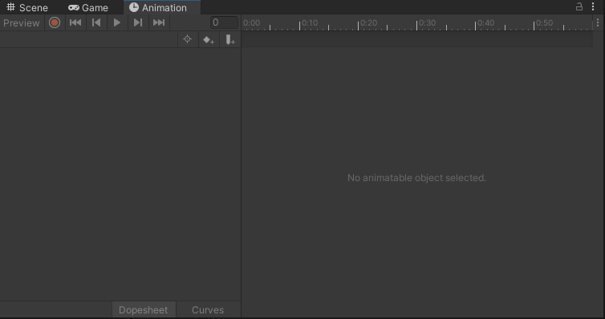
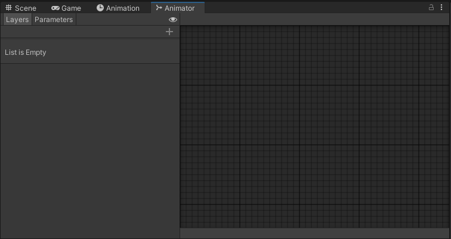
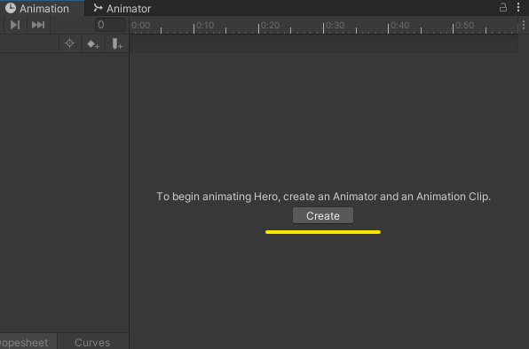
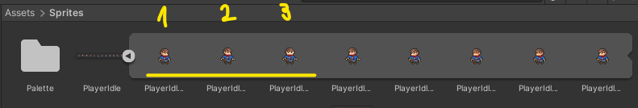
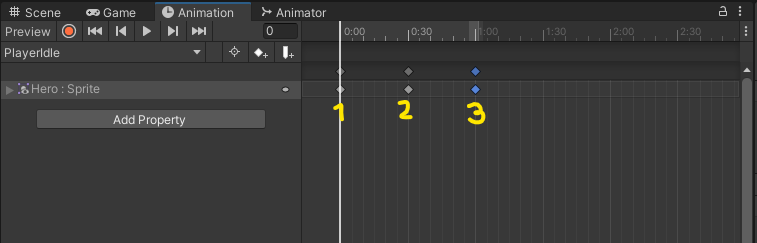

# Animando nuestro personaje

Oh Yeah!! Ya esta bien de mover el muñeco por la pantalla mas tieso que una mojama. Que birra es esta??!!

Pues si, hasta el momento, hemos conseguido que nuestro personaje se mueva y salte, pero la verdad, tiene menos movimiento que Epi en una cama de velcro. En este capítulo vamos a ver como animar a nuestro querido amigo pixelado, para que pueda tener vida (Igooor!! Vive!! Viveee!!), cual cientifico loco viendo cobrar vida a su creación, nuestro personaje tendra la capacidad de andar, estar parado o saltar sin ser un movimiento totalmente estático. Asi que, sin nada mas que contar, comenzamos.

## Animate o te animo
Bien, en este punto vamos a comenzar con la animación de nuestro personaje. Lo primero que vamos a hacer es ir al menu de Unity, le damos en `Window` -> `Animation` -> `Animation`.

Esto nos va a abrir el panel `Animation`, el cual yo he colocado del siguiente modo.

A continuación le damos a `Window` -> `Animation` -> `Animator`, el cual lo vamos a poner tal que asi.

Bien, seguidamente seleccionamos a nuestro player y nos vamos en la ventana `Project` a la carpeta donde tenemos descargado nuestro `PlayerIdle` ya recortado (acuerdate que lo hicicimos en el [Capítulo 01](01_TilesYSprites.md)).

Lo primero que haremos será darle en el panel `Animation` al botón que nos ha aparecido y que pone `Create`.

A continuación, vamos a crear una carpeta dentro de nuestra carpeta `Assets`, la cual vamos a llamar `Animations` que es donde vamos a guardar todas las animaciones que creemos. A esta que vamos a crear la vamos a llamar `PlayerIdle.anim`.

Una vez hecho esto, vamos a ver que la ventana `Animation` a cambiado para permitir crear nuestra primera animación, lo cual lo haremos del siguiente modo:

 * Arrastramos a la ventana animation los siguientes `sprites` en el siguiente orden

 

 * Vamos colocando los `sprites` anteriores segun el orden 1, 2 y 3 tal y como se muestra en la imagen de acontinuación.

  