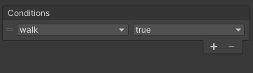
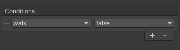

# Animando nuestro personaje

Oh Yeah!! Ya esta bien de mover el muñeco por la pantalla mas tieso que una mojama. Que birra es esta??!!

Pues si, hasta el momento, hemos conseguido que nuestro personaje se mueva y salte, pero la verdad, tiene menos movimiento que Epi en una cama de velcro. En este capítulo vamos a ver como animar a nuestro querido amigo pixelado, para que pueda tener vida (Igooor!! Vive!! Viveee!!), cual cientifico loco viendo cobrar vida a su creación, nuestro personaje tendra la capacidad de andar, estar parado o saltar sin ser un movimiento totalmente estático. Asi que, sin nada mas que contar, comenzamos.

## Animate o te animo
Bien, en este punto vamos a comenzar con la animación de nuestro personaje. Lo primero que vamos a hacer es ir al menu de Unity, le damos en `Window` -> `Animation` -> `Animation`.

Esto nos va a abrir el panel `Animation`, el cual yo he colocado del siguiente modo.


A continuación le damos a `Window` -> `Animation` -> `Animator`, el cual lo vamos a poner tal que asi.


Bien, seguidamente seleccionamos a nuestro player y nos vamos en la ventana `Project` a la carpeta donde tenemos descargado nuestro `PlayerIdle` ya recortado (acuerdate que lo hicicimos en el [Capítulo 01](01_TilesYSprites.md)).

Lo primero que haremos será darle en el panel `Animation` al botón que nos ha aparecido y que pone `Create`.


A continuación, vamos a crear una carpeta dentro de nuestra carpeta `Assets`, la cual vamos a llamar `Animations` que es donde vamos a guardar todas las animaciones que creemos. A esta que vamos a crear la vamos a llamar `PlayerIdle.anim`.

Una vez hecho esto, vamos a ver que la ventana `Animation` a cambiado para permitir crear nuestra primera animación, lo cual lo haremos del siguiente modo:

 * Arrastramos a la ventana animation los siguientes `sprites` en el siguiente orden

 

 * Vamos colocando los `sprites` anteriores segun el orden 1, 2 y 3 tal y como se muestra en la imagen de acontinuación.

 

Ya tenemos creada nuestra primera animación, asi que como yo sabemos como hacerlo, vamos a crear otra a la cual vamos a llamar `PlayerWaling`, para la cual usaremos nuestros `sprites` que descargamos en el capítulo 1 y que se llamaban igual. Si no tienes los `sprites` cortados (`slice`), no te voy a volver a explicar como se hace, si no los tienes, recortalos y create una nueva animación como ya te he comentado.

 

Bueno, supongo que ya habras montado tu animación de `PlayerWalking`, verdad?? Pues sigamos.

### Creando cambios y transiciones con Animator

Bien, lo siguiente que vamos a hacer, es que nuestro personaje cambie de la animación de estarse quieto (`PlayerIdle`) a caminar (`PlayerWalking`), para ello vamos a usar `Animator`. 

Aquí es donde se van a meter la condiciones y propiedades necesarias para controlar los cambios entre animaciones. Tranquilo, te lo voy a dar muy mascado, para que no te lies demasiado.

 1 - Vamos a crear una transición entre `PlayerIdle` y `PlayerWalking`. Nos situamos encima de `PlayerIdle` y le damos click derecho, a continuación damos a `Make Transition`.

 

 2 - Hacemos lo mismo que en el punto 1, pero esta vez desde `PlayerWalking` hacia `PlayerIdle`.

 3 - Le damos a `Parameters` y añadimos un nuevo parámetro de tipo `Bool` al que llamaremos `walk`.

 

 

 4 - Seleccionamos cada transición (_las lineas con las flechas de Animator_, _la de Entry a PlayerIdle NO_) y en las propiedades del panel `Inspector`, desmarcamos `Has Exit Time` y ponemos como valor en `Transition Duration` 0.

 

 5 - Añadimos a cada transición una condición, la cual será en función del valor de la variable `walk`.
 
 

 

 6 - Una vez añadidas las condiciones, debemos modificar nuestro `script PlayerController` para que dichas condiciones actuen.
  * Agregamos a nuestro `script` una variable de clase nueva para referenciar al componente `Animator`.
  `Animator anPlayer;` 

  * Referenciamos al componente en el metodo `Start` con instrucción:
  `anPlayer = gameObject.GetComponent<Animator>();`

  * A continuación modificamos el método `MoveHorizontalPlayer`:
  ```c#
    void MoveHorizontalPlayer()
    {
        //Aplicamos una fuerza para desplazar al personaje horizontalmente
        rbPlayer.AddForce(Vector2.right * speedPlayer * Input.GetAxisRaw("Horizontal") * Time.deltaTime );
    
        if (Mathf.Round(rbPlayer.velocity.x) > 0 || Mathf.Round(rbPlayer.velocity.x) < 0)
        {
            anPlayer.SetBool("walk", true); //Cambia el valor de la variable del Animator
            Debug.Log(Mathf.Round(rbPlayer.velocity.x)); 
        }
        else if (Mathf.Round(rbPlayer.velocity.x) == 0) anPlayer.SetBool("walk", false);
    }
  ``` 
