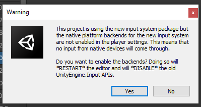

# Nuevo Sistema de Inputs de Unity

El nuevo sistema de Inputs de Unity, nos permite definir una serie de acciones y comportamientos para uno o varios controles totalmente distintos, como por ejemplo (teclado, gamepad, joystick, etc...)

Para poder emplear el nuevo sistema de inputs de Unity, lo primero que debemos hacer es ir al Package Managar, en Unity Registry e instalar el paquete.

Cuando se instale, nos aparecerá el siguiente mensaje:

 

Le daremos a `Yes` y se nos reiniciará Unity, de modo que ya podremos utilizar el nuevo sistema de Inputs. Peeero, quieto `parao` que antes tendremos que configurar algunas cosas "*como dijo Jack el Destripador...*"
> Vayamos por partes.

