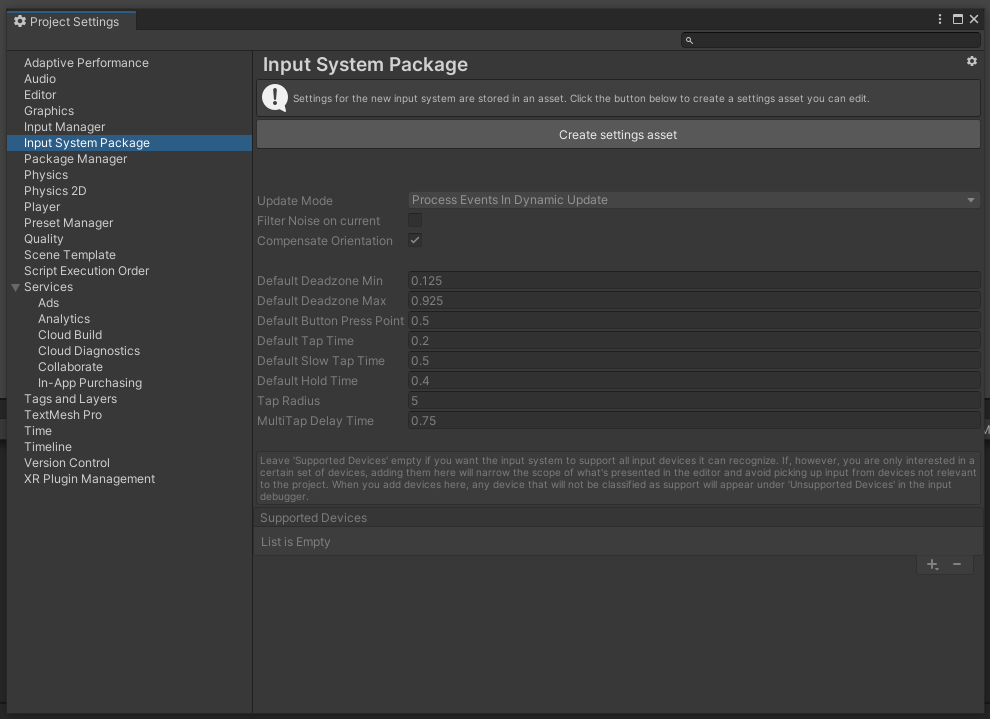
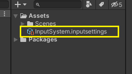
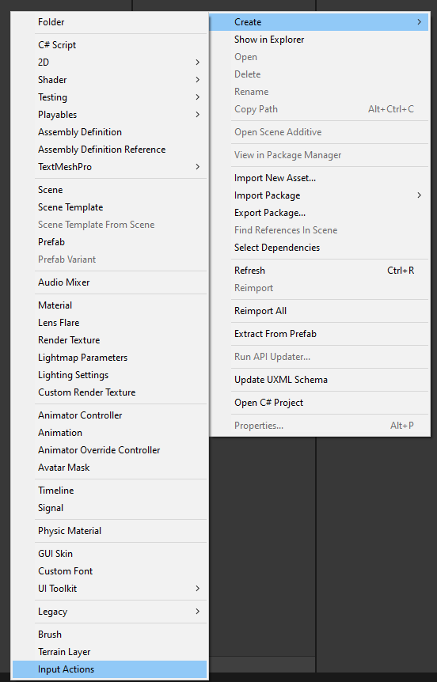
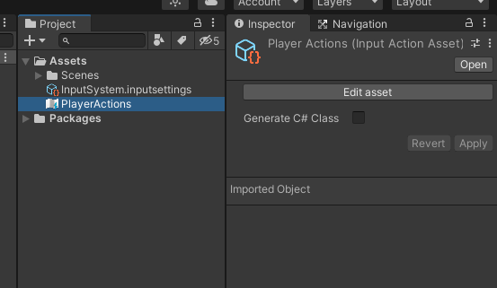
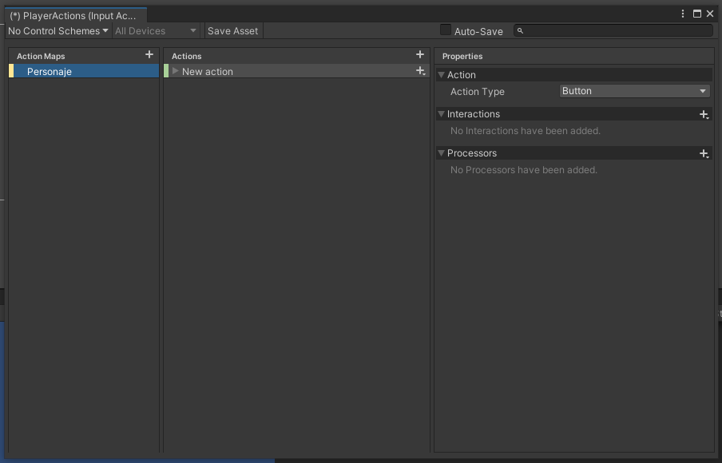
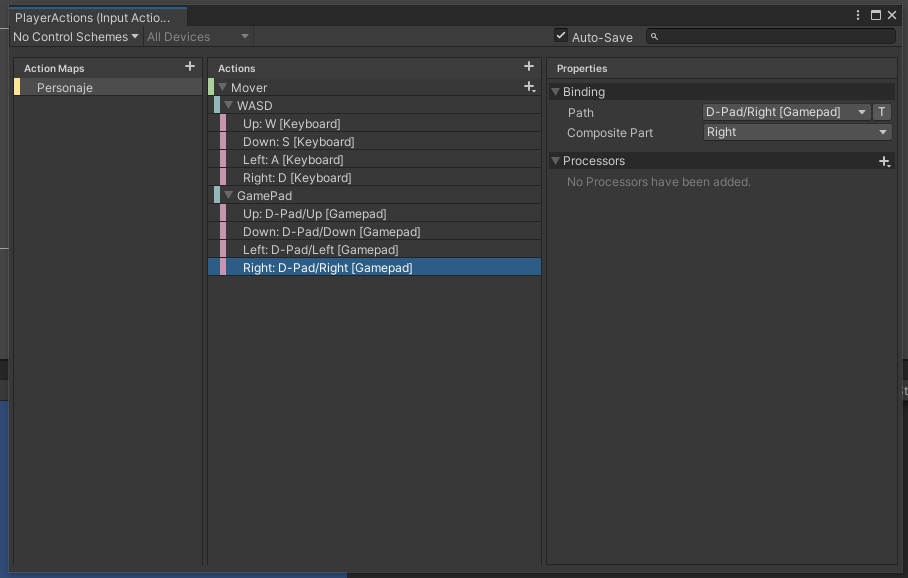
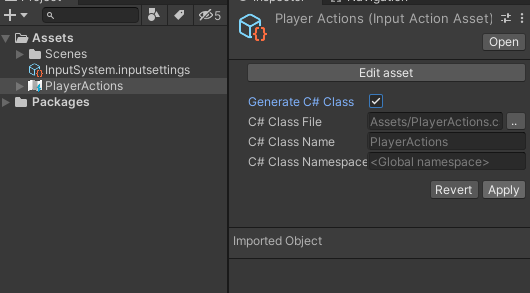
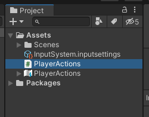
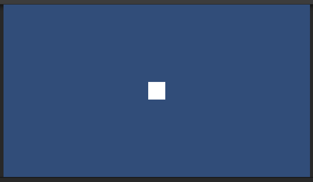

# Nuevo Sistema de Inputs de Unity

El nuevo sistema de Inputs de Unity, nos permite definir una serie de acciones y comportamientos para uno o varios controles totalmente distintos, como por ejemplo (teclado, gamepad, joystick, etc...)

Para poder emplear el nuevo sistema de inputs de Unity, lo primero que debemos hacer es ir al Package Managar, en Unity Registry e instalar el paquete.

Cuando se instale, nos aparecerá el siguiente mensaje:

 

Le daremos a `Yes` y se nos reiniciará Unity, de modo que ya podremos utilizar el nuevo sistema de Inputs. Peeero, quieto `parao` que antes tendremos que configurar algunas cosas "*como dijo Jack el Destripador...*"
> Vayamos por partes.

Pues bien, una vez instalado el paquete del `Nuevo Input System` de Unity, lo siguiente que tendremos que hacer, es irnos a `Edit -> Project Settings` y una vez en la ventana de `Project Setting` nos iremos a donde pone Input System Package (si no lo tienes clarinete, te dejo una imagen, que siempre vale mas que mil palabras o al menos eso dicen).

 

Una vez que estemos ahí, le daremos a `Create Settings Asset` y con esto, se nos creará el archivo de configuración que será el que controle como queramos que se comporten nuestros inputs.

Si has seguido todos los pasos correctamente, se te ha tenido que crear un archivo dentro de tus `Assets` del proyecto tal y como este.

 

Lo siguiente que haremos será crear un `Input Actions`, y para ello, nos vamos a la pestaña `Project` y damos click derecho para mostrar el menu, damos a `Create -> Input Actions`.

 

Este asset que hemos creado, será el que tenga definidas todas las acciones que queramos que sean controladas como por ejemplo, andar, saltar, atacar, etc... para el ejemplo, yo he llamado al asset `PlayerActions`, pero tu puedes ponerle el nombre que te salga de la pera.

 

Si le damos doble click al asset que hemos creado (`PlayerActions` por si se te habia olvidado...) se nos abrirá una ventana para configurar nuestras acciones.

La ventana se compone de 3 partes bien definidas:
 - Action Maps: Aquí crearemos el mapa de acciones que vayamos a utilizar, para el ejemplo yo lo voy a llamar personaje.
  
  

 - Actions: Aquí se definiran las acciones que podrá gestionar (mover, saltar, agacharse, disparar, etc...) las cuales se verán definidas mediante los controles que podrán gestionarlas.
  Para crear nuestras acciones, simplemente daremos al boton `+` que está en la sección `Actions` y aquí definiremos una nueva acción. Para el ejemplo, vamos a definir una acción que se va a llamar `Mover`.
  Debajo de la acción `Mover` donde inicialmente nos aparece como `<No Binding>` será donde definamos lo botones o controles que realizarán dicha acción.

 - Properties: Es donde se definirán las propiedades de las acciones que realizarán los controles (los botones o controles que lo gestionarán), lo cual para ello primero definiremos un nuevo `Binding` haciendo click en `Path` donde buscaremos el control y la tecla que deseemos.
  

Si nos fijamos en la imagen superior, veremos que he definido diferentes controles para mover al personaje tanto un teclado como un gamepad.

Lo siguiente que vamos a tener que hacer, es seleccionar el asset que habiamos creado y al que yo llame `PlayerActions`, tu lo habrás llamado como te haya venido en gana, pero como esto lo escribo yo, pues vamos a seguir con ese nombre. Pues bien, una vez seleccionado nuestro `PlayerActions` en el inspector vamos a marcar la casilla que pone `Generate C# Class` y una vez hecho, le damos en `Apply`.

 

Una vez hecho esto último, se nos creará un script que se llamará como nuestro asset (`PlayerActions` en mi caso).

 

Este nuevo script, es el que vamos a tener que utilizar para poder actuar con las acciones que hayamos definido, mediante código c#.

Ahora es donde la cosa se pone guapa... Vamos a crear un cuadrado en una escena 2D el cual vamos a controlar mediante nuestro nuevo y flamante Input System.

Para esto, yo he creado una escena tal que así.

 

En esta escena, tan solo tenemos un sprite 2D cuadrado, al cual le he aplicado un Rigidbody2D al que lo he puesto como `Kinematic` para que la gravedad no le afecte.

Y a continuación, vamos a crear un script al cual vamos a llamar `MoverCuadrado.cs` que emplearemos para mover a nuestro cuadrado y que tendrá la siguiente pinta:

 ```c#
 using System.Collections;
 using System.Collections.Generic;
 using UnityEngine;
 using UnityEngine.InputSystem; //NO OLVIDAR INCLUIR LA LIBRERIA PARA PODER USAR EL NUEVO INPUT SYSTEM

 public class MoverCuadrado : MonoBehaviour
 {
     [SerializeField] Rigidbody2D rbCuadrado;
     [SerializeField] float velocidadCuadrado = 8;

    
     void Awake()
     {
         rbCuadrado = GetComponent<Rigidbody2D>();    
     }

    
     void Update()
     {
        
     }

     void MoverObjeto()
     {

     }

     void LeerControles()
     {

     }
 }
 ```